# Sportswear


Welcome to the online sportswear store. This app allows users to purchase clothing and accessories for both sports and casual wear.

Some features on the site are available exclusively to registered users, including viewing your order history, saving items to your wishlist, and adding product reviews.

Users can search for products, view product details, add to cart, and make payment. There is also a feedback page, a privacy policy and a section on returning goods.

[Live link to Sportswear](https://sportswear-ebbdbb6bb6ec.herokuapp.com/)


<br>

# Table of Contents

1. [UX](#ux)
2. [The Strategy Plane](#the-strategy-plane)
    * [Targeted Users](#targeted-users)
    * [Site Goals](#site-goals)
    * [Project Goals](#project-goals)
3. [Agile Planning](#agile-planning)
    * [User Stories](#user-stories)
4. [Fundamental Structure](#fundamental-structure)
    * [Wireframes](#wireframes)
    * [Database Schema](#database-schema) 
5. [Main plan](#main-plan)
6. [Structure Plane](#structure-plane)
    * [Features](#features)
    * [Home Page](#home-page)
      * [Featured Products Section](#featured-products-section)
      * [Healthy Lifestyle and Sporty Fashion Section](#healthy-lifestyle-and-sporty-fashion-section)
      * [Footer](#footer)
    * [Returns Page](#returns-page)
    * [Contact Page](#contact-page)
    * [Privacy Policy](#privacy-policy)
    * [Main Nav Menu](#main-nav-menu)
    * [Restricted Pages](#restricted-pages)
    * [Product Filtration](#product-filtration)
    * [Search Bar](#search-bar)
    * [Sale Page](#sale-page)
    * [Product Details Page](#product-details-page)
    * [Wishlist Page](#wishlist-page)
    * [My Account Dropdown](#my-account-dropdown)
    * [User Sign Up Page](#user-sign-up-page)
    * [User Sign In Page](#user-sign-in-page)
    * [User Sign Out Page](#user-sign-out-page)
    * [User Profile Page](#user-profile-page)
    * [Basket Page](#basket-page)
    * [Checkout Page](#checkout-page)
    * [Error Page](#error-page)
    * [Future Features](#future-features)
7. [Design](#design)
      * [Colour Scheme](#colour-scheme)
      * [Typography](#typography)
      * [Images](#images)
8. [Business Model](#business-model)
    * [Marketing Strategy](#marketing-strategy)
      * [Social Media Marketing](#social-media-marketing)
      * [Newsletter Marketing](#newsletter-marketing)
    * [Search Engine Optimization (SEO)](#search-engine-optimization-seo)
      * [Keywords](#keywords)
      * [SiteMap](#sitemapxml)
      * [Robots](#robotstxt)
9. [Technologies](#technologies)
    * [Languages Used](#languages-used)
    * [Frameworks Used](#frameworks-used)
    * [Libraries And Installed Packages](#libraries-and-installed-packages)
    * [Tools and Resources](#tools-and-resources)
10. [Testing](#testing)
11. [Bugs](#bugs)
12. [Credits](#credits)
13. [Deployment](#deployment)
14. [Acknowledgements](#acknowledgements)

<br>

# UX

## The Strategy Plane

### Targeted Users

- Users looking to browse and purchase high-quality sportswear.
- Users seeking the latest arrivals in sportswear from top brands.
- Sports enthusiasts and those interested in an active lifestyle, curious about trends in the world of sports fashion.

### Site Goals

- Enabling users to swiftly and effortlessly search for products.
- Facilitating quick and easy product purchases for users.
- Providing users with the option to create an account to store their Wishlist and view their order history.
- Allowing users to conveniently edit their saved address for streamlined purchasing.
- Offering users the ability to contact the business online.

### Project Goals

- Develop a  functional e-commerce website.
- Incorporate comprehensive features for a professional online store experience.
- Apply knowledge gained from previous projects to make this website more advanced.
- Introduce new elements, such as a wishlist and user reviews, to enhance CRUD functionality.
- Ensure a user-friendly interface for easy navigation and a seamless shopping experience.

<br>

[Back to Top](#table-of-contents)

<br>

## **Agile Planning**

My project followed an agile planning approach, based on user stories. Each user story was meticulously plannedand and included in a specific iteration

To prioritize development efforts, features were categorized as Must Have, Should Have, Could Have, and Won't Have. This classification helped determine the importance of each feature.

The product section took precedence as the primary focus of the website, receiving the most attention and time for completion. 

The Project board [here](https://github.com/users/CodeWizard-1/projects/5).


[Back to Top](#table-of-contents)

<br>

## User Stories

* Based on the collected and studied user stories, a project implementation plan was developed.
You can read user stories [here](https://github.com/CodeWizard-1/e-commerce/issues?q=is%3Aissue+is%3Aclosed).


* Each user story was assigned a point value based on the complexity of implementation. Using the MoSCoW principle (Must Have, Should Have, Could Have, Won't Have), iterations were planned for the implementation of the identified tasks.

You can read milestones [here](https://github.com/CodeWizard-1/e-commerce/milestones?state=closed).


<br>

[Back to Top](#table-of-contents)

<br>


## Fundamental Structure

### Wireframes

- To facilitate the design of the website, I created wireframes for every page. Adhering to best practices, wireframes were crafted for mobile and desktop dimensions. [Balsamiq](https://balsamiq.com/) was employed as the tool for creating the site's wireframes.

### Home Page Wireframes

<details>
<summary>Click to View Home Page wireframes</summary>

#### Mobile


#### Desktop


</details>

### All Products Page Wireframes

<details>
<summary>Click to View All Products Page wireframes</summary>

#### Mobile


#### Desktop


</details>

### Product Detail Page Wireframes

<details>
<summary>Click to View Product Detail Page wireframes</summary>

#### Mobile


#### Desktop
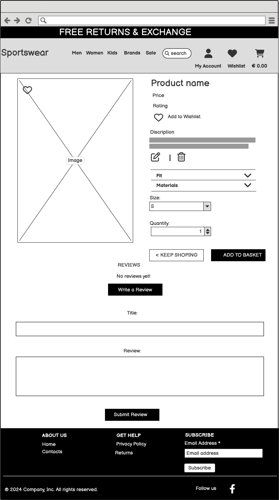

</details>

### Basket Page Wireframes

<details>
<summary>Click to View Basket Page wireframes</summary>

#### Mobile


#### Desktop


</details>

### Checkout Page Wireframes

<details>
<summary>Click to View Checkout Page wireframes</summary>

#### Mobile


#### Desktop


</details>


### Contact Page Wireframes

<details>
<summary>Click to View Contact Page wireframes</summary>

#### Mobile


#### Desktop


</details>

### Wishlist Page Wireframes

<details>
<summary>Click to View Wishlist Page wireframes</summary>

#### Mobile


#### Desktop


</details>

### Edit Reviews Wireframes

<details>
<summary>Click to View Edit Reviews wireframes</summary>

#### Mobile


#### Desktop


</details>


### Database Schema

- I created an entity relationship diagram using  [Drawsql.app](https://drawsql.app/). This allowed me to visually represent the connections between my data structures and streamlined the development process significantly. Now, I have a visual guide, making it much easier to understand and interact with my data.

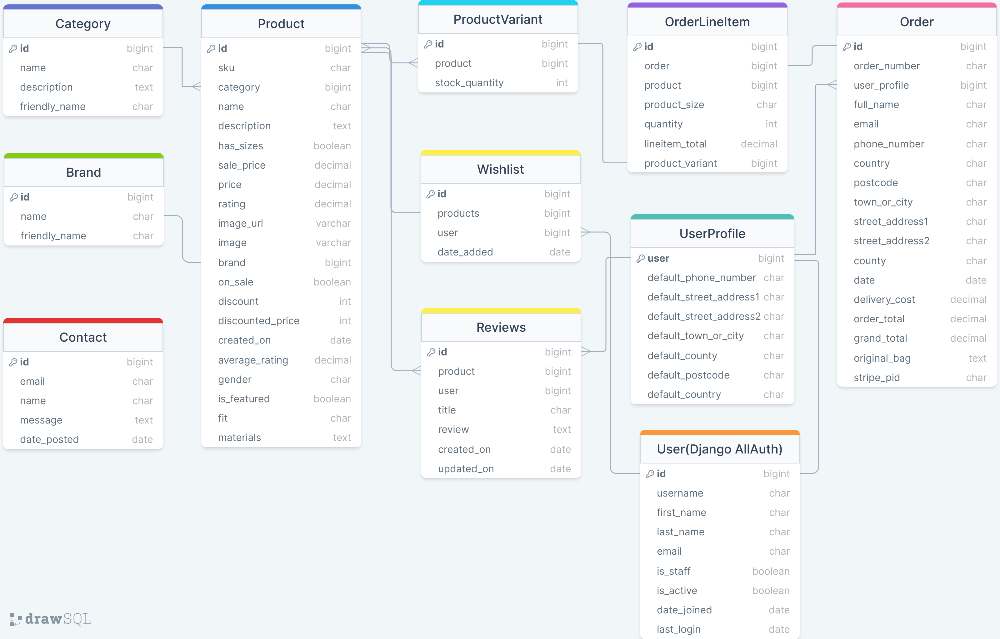

[Back to Top](#table-of-contents)

<br>

## Main plan
- Designing a homepage featuring a compelling hero images that instantly communicates the website's purpose to users.
- Implementing account registration to enable restricted access for editing and deleting reviews, managing wishlists, and saving user information for faster checkouts in the future.
- Developing a fully responsive website, ensuring seamless functionality across all screen sizes, with optimized navigation for mobile users.
- Empowering superusers with the capability to create, view, update, and delete reviews for both users and products.

<br>

[Back to Top](#table-of-contents)

<br>

## Structure Plane

# Features 

## Existing Features

### Home Page

The Home page of the online store is an attractive and informative landing page, created to attract attention users.

<br>

[Back to Top](#table-of-contents)

<br>


### Featured Products Section

- The "Trending This Week" section will showcase a random list of 5 products marked as "Is_Featured" on the admin panel.
- Each product is presented with a card displaying its details.

<br>

[Back to Top](#table-of-contents)

<br>

### Healthy Lifestyle and Sporty Fashion Section

- This section is a description of the activities of the online store with the inclusion of high-frequency keywords for search engine optimization

<br>

[Back to Top](#table-of-contents)

### Footer

- The footer is consistently present on every page, featuring links to Contact, Returns, Privacy Policies, and an email address.
- Additionally, the footer incorporates our newsletter signup, powered by MailChimp. This ensures its visibility on every page, maximizing the likelihood of visitors subscribing.


<br>

[Back to Top](#table-of-contents)

<br>

### Returns Page


- The product returns page provides detailed information about the return policy of the online store
<br>

[Back to Top](#table-of-contents)

<br>

### Contact Page

- On the contact page, concise information is presented using small icons for quick and easy comprehension, including a phone number, address, and email.
- Additionally, the page includes a contact form enabling users to reach out to the business. The information submitted through this form is stored in the Admin panel, ensuring easy access for staff to review.

<br>

[Back to Top](#table-of-contents)

<br>

### Privacy Policy

- A privacy policy is a legal document that describes how a website collects, uses, discloses and manages the personal information of its users or customers. It contains information about the types of data collected, the purposes for collecting it, storage and security methods, and the rights of users regarding their personal information.

<br>

[Back to Top](#table-of-contents)

<br>

### Main Nav Menu


 - At the very top there is an information board in which information about the terms of return, delivery, the minimum order amount for free delivery is updated every three seconds (to encourage the user to buy  more number of products), as well as a motivational phrase as a call to action.


- Throughout the site, the user has access to the main navigation menu. Features include a search bar, account/profile access, cart link and subtotal if the user has added items to their carts, as well as links to filter products by gender, brand and sale page. Once logged in, users have access to the wishlist page.


<br>

[Back to Top](#table-of-contents)

<br>

### Restricted Pages


- Certain pages are accessible only to users who have logged in. Links to these pages are displayed in the Navbar exclusively when a user is logged in.
- The Wishlist feature is reserved solely for users who have registered an account.

<br>

[Back to Top](#table-of-contents)

<br>

### Product Filtration


- When selecting the desired product, the user can filter by men's, women's and children's products.
- The user can also filter by brand.


- On the product page, the user can filter the product by price, rating, name, category and brand

<br>

[Back to Top](#table-of-contents)

<br>

### Search Bar


- Users can use the search bar in the navigation menu to find specific products. The search term is matched with the product name and description to provide the user with a list of products that match their search query.
The user can also see how many results were returned for their search query.
If the user clicks the search button without entering anything, an error message is displayed.

<br>

[Back to Top](#table-of-contents)

<br>

### Sale Page


- This page displays all products that are participating in the promotion with a price reduction


<br>

[Back to Top](#table-of-contents)

<br>

### Product Details Page

- Product details page displays product image, name, regular price, discount price (if available), brand, category, rating, option to add to wishlist, product description, option to select size (if available), select quantity and user can add product to cart.
- The page also displays reviews left by users, with the option for authorized users to leave their own.
- Reviews can be updated or deleted by the user who left them or by the administrator/superuser. These are all CRUD functions.

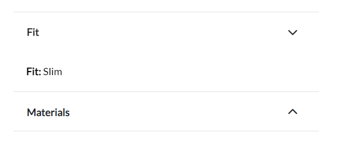
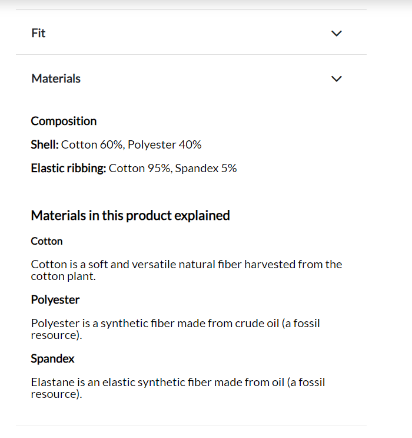

- Also in the drop-down window you can see Fit as well as the material from which the clothes are made.

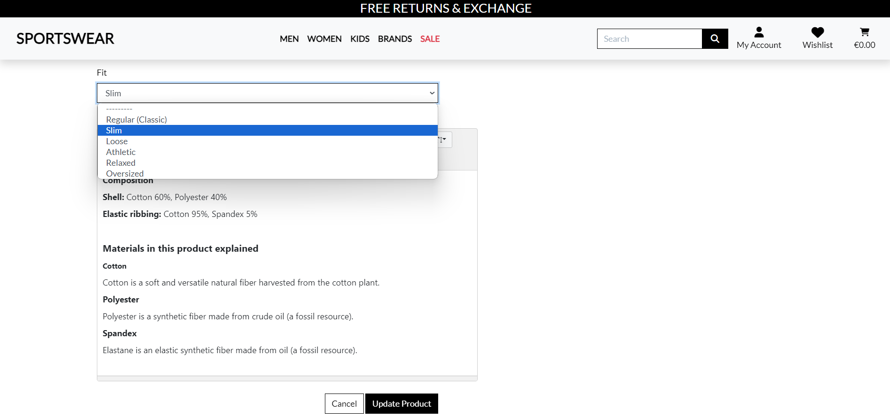
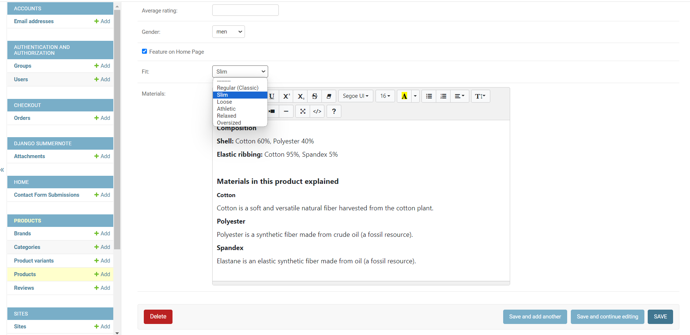

- You can make changes to Fit and Materials either in the admin panel or on the editing page directly on the site with access rights as an administrator.


- If the user is not authorized, he is prompted to log into his account or register.


- If the user is authorized, he can click on “Write a Review” to write a review.
 


- A window will open below in which the user can specify a topic and leave a review.


- After writing a review and sending it, the user will see a success message.


- If necessary, the user can update his review.


- After updating the review, the user will see a success message.


- If the user decides to delete a review, he will also be informed about the successful action in the message


-For the convenience of the user, to quickly return to the top of the page, a button has been added to the lower right corner when clicked on which the user will return to the top of the page


<br>

[Back to Top](#table-of-contents)

<br>

### Wishlist Page

- The Wishlist page allows users to get a list of all the products they have added to their wishlist by clicking the heart icon on each product.
- The Wishlist page provides a brief description of the product as well as a link to the product detail page that allows users to add it to their cart.
- The page also has a delete option that allows users to remove a product from their wishlist - again, this is done using the CRUD function.

- If the user has not added any product to the wishlist, he will see the message below.


- To add a product to your wishlist, you need to click on the heart icon on the page with the product description or on the page with the total quantity of the product.


- After successfully adding a product, the heart icon will change color and an additional message will appear.


- If you click on the heart icon again, the item will be removed from your wishlist and there will be an additional message about it.


- On the wishlist page itself, you can click on the binoculars icon to go to the product page.


- You can remove a product from your wish list by clicking on the product removal icon, and if you want to remove the entire product from the list, you need to click on the “CLEAR WISHLIST” sign at the top.


<br>

[Back to Top](#table-of-contents)

<br>

### My Account Dropdown

- If the user is logged in, the My Account drop-down in the navigation menu will contain a link to the user's profile.
- If the user is not logged in, they will be given the option to either register for an account or log into an existing account.
- If the user is logged in and has administrator rights, he will see an additional menu "Product Management"


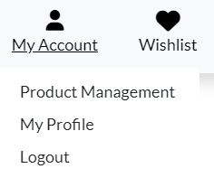


- If the user is logged in and has admin permissions, they can add new products to the site from the admin dropdown in the nav menu.
- The add product page contains a form for the admin to fill out with the details of the new product.


- If the user is logged in and has admin permissions, they can edit site products by clicking the edit icon on either the product card on the all products page or the individual product page.
- The edit product page contains the same form as the add product page but the fields are already populated with the product's current data.


- If the user is logged in and has admin permissions, they can delete site products by clicking the delete icon on either the product card on the all products page or the individual product page.


<br>

[Back to Top](#table-of-contents)

<br>

### User Sign Up Page

- Users without an account can register by clicking the "Register" link in the main navigation menu. They will be given a form to add their details and create a profile for that user upon completion.


- Users are sent a confirmation email to complete account registration

<br>

[Back to Top](#table-of-contents)

<br>

### User Sign In Page


- If the user is not logged into the site but has a profile, they can click on the login link where they will be presented with a login page. To do this, they must enter their username or email address and the correct password. There is also a checkbox to remember the user on their current device to avoid having to log in every time they visit the site.


<br>

[Back to Top](#table-of-contents)

<br>

### User Sign Out Page


- If the user is not logged into the site but has a profile, they can click on the login link where they will be presented with a login page. To do this, they must enter their username or email address and the correct password. There is also a checkbox to remember the user on their current device to avoid having to log in every time they visit the site.


<br>

[Back to Top](#table-of-contents)

<br>

### User Profile Page


- When the user has completed registration on the site, he is provided with a profile. The profile contains information about the default delivery address, if one is set, and a list of the user's previous orders.


- There is a form in the user's profile that contains default delivery information if the user has saved it. The user can update this information from their profile by editing the form and clicking the "Update Information" button. This information will be automatically used the user's next purchase to make the site more convenient for customers.


- Users can view a list with complete order history in their profiles. The data is displayed in a table, each row of which contains the order number, time and date of purchase, items included in the order, and the total amount of each order.
- The order number contains a link that, when clicked, takes the user to the order confirmation page for that specific order containing all the details about that order, as well as a link to return to the user's profile.

<br>

[Back to Top](#table-of-contents)

<br>


### Basket Page

- The basket can be accessed from the main navigation menu.
The menu displays the running total of items in the user's basket.
When the user clicks on this, they can see all the items in their basket, the individual price of each product, a subtotal for the product if the quantity is greater than 1, and a quantity switch for each product with buttons to update the quantity or remove the product entirely from your basket.


- If the user has nothing in their basket, a message will appear prompting the user to continue shopping


- Similar to the quantity selector on an individual product page, users can adjust the quantity of a product already in their basket.
- From here, the user can add a maximum quantity of 99 items to the cart in the same way as on the individual product page. Or it can be removed from the basket.


- This is the amount that the user’s cart will be after adding up all the products and their quantities.
- Under the cart amount, the user can see the shipping cost. If the value of the basket exceeds 50 euros, delivery is free, otherwise it is calculated as 10% of the order amount.


- Once the total is calculated, users will see two buttons: one to continue shopping and one to proceed to checkout.


<br>

[Back to Top](#table-of-contents)

<br>

### Checkout Page


- The final step in a user's shopping journey on a website is the checkout page.
- This page contains a form for the user's shipping and payment information, as well as a summary of the user's order.
- If a user has an account on the site, they can save shipping information to their profile so that it is automatically filled in when placing an order.


- When placing an order, the user can add their details and, if logged in, check the box to save their details for future transactions.
- Users must enter their payment information before completing checkout, and all payments are processed through Stripe.


- The final summary of the user's order is displayed, containing all of the user's cart items, the quantity, and the running total for each item.
- The user can also see the order total, shipping costs, any discounts applied, and the total in a summary.


- At the very end of placing an order, the user will see two buttons: one for setting up a cart, the other for placing an order.
- The total amount is displayed below the order completion button to further inform the user of how much will be charged to their card once the order is completed.


- Once the order is completed and payment has been received, the user will receive an order confirmation email containing the order number and a receipt showing the total payment amount.


- Once the order is completed, the user is redirected to a confirmation page informing them that an order confirmation email has been sent to the provided email address.
- This page contains the final description of the order and what the user purchased.
- This page can be accessed again from the user's profile if they have an account on the site by clicking on the order number in the list of past orders.


<br>

[Back to Top](#table-of-contents)

<br>

### Error Page

- If a user lands on a page that either doesn't exist or that they shouldn't be on (a regular user using links on an admin page or trying to edit/delete something from a link), they will be shown an error message and button to return to store.
<br>

[Back to Top](#table-of-contents)

<br>


## Future Features

- If I had extra time, I would implement several new features on the site. Currently, product ratings are simply random numbers entered when adding a product through the settings file. However, I want users to also be able to give a product rating, calculated as an average.

- There are also plans to implement functionality that allows you to display the number of goods sold and their sizes in the administrative panel, as well as provide information about the availability of goods by size.

- Additionally, to attract more visitors, I would introduce a blog with information about the latest trends in the world of sportswear.

- Also complete the [USER STORY: Password Recovery](https://github.com/CodeWizard-1/e-commerce/issues/17).

<br>

[Back to Top](#table-of-contents)


## Design
### Colour Scheme
- The following colors were chosen for the website: white, which is associated with purity, freshness and lightness; gray, which is a universal color and adds elegance and restraint; blue, considered universal and popular; red, often associated with energy, passion and strength, which can draw attention to sportswear; and black, symbolizing class and elegance.


### Typography
 - The site chose the Lato font due to its excellent readability, modern design and versatility

### Images
- All images used as educational material were taken from these sites [Freepik](https://www.freepik.com/), [Nike](https://www.nike.com/), [Adidas](https://www.adidas.ie/), [Puma](https://eu.puma.com/).

<br>

[Back to Top](#table-of-contents)

<br>

## **Business Model**

This online resource operates on the principle of Business to Customer model, providing the opportunity to purchase sportswear directly to consumers. It is designed to make it easy for both registered and unregistered users to pay for purchases, with additional features available to registered users and newsletter subscribers.

[Back to Top](#table-of-contents)

## **Marketing Strategy**

### **Social Media Marketing**

The main task of this page on the social network Facebook is to inform about new products, notify subscribers about offers and promotions, as well as place targeted advertising.


### **Newsletter Marketing**

 In the footer of the website is a [Mailchimp](https://mailchimp.com/?currency=EUR) newsletter in the footer which is used to send emails to subscribers about the latest products, promotions and discounts.


[Back to Top](#table-of-contents)

## **Search Engine Optimization (SEO)**

### **Keywords**

Keywords were analyzed and added to the description of the online store on the main page of the site


### **Sitemap.xml**

I created a sitemap using [XML-Sitemaps](https://www.xml-sitemaps.com) on my live website [https://sportswear-ebbdbb6bb6ec.herokuapp.com/](https://sportswear-ebbdbb6bb6ec.herokuapp.com/)

The XML that was created is in the root directory of the website.

### **Robots.txt**

The robots.txt file was created using this guide [https://www.conductor.com/academy/robotstxt/](https://www.conductor.com/academy/robotstxt/).


[Back to top](#table-of-contents)

<br>

# Technologies

## Languages Used
* [HTML5](https://en.wikipedia.org/wiki/HTML5)
* [CSS3](https://en.wikipedia.org/wiki/Cascading_Style_Sheets)
* [Javascript](https://en.wikipedia.org/wiki/JavaScript)
* [Python](https://en.wikipedia.org/wiki/Python_(programming_language))

## Frameworks Used

* [Django](https://www.djangoproject.com/)
* [Bootstrap](https://blog.getbootstrap.com/) 

## Libraries And Installed Packages

* [coverage](https://pypi.org/project/django-coverage/) - Used for running automated tests.
* [pytest](https://docs.pytest.org/en/7.2.x/) - Used for running automated tests.
* [pytest-cov](https://pypi.org/project/pytest-cov/) - Used for running automated tests.
* [crispy-bootstrap4](https://pypi.org/project/crispy-bootstrap4/) - Template pack used for django-crispy-forms
* [django-crispy-forms](https://pypi.org/project/crispy-bootstrap4/) - Used to render forms throughout the project.
* [dj-database-url](https://pypi.org/project/dj-database-url/) - A package used to utilize DATABASE_URL environment variable.
* [dj3-cloudinary-storage](https://pypi.org/project/dj3-cloudinary-storage/) - Facilitates integration with Cloudinary by implementing Django Storage API.  
* [django-allauth](https://django-allauth.readthedocs.io/en/latest/) - Allows authentication, registration and account management in Django.
* [django-countries, v7.2.1](https://pypi.org/project/django-countries/7.2.1/) - Django application used to provide country choices for use with forms, and a country field for models.
* [gunicorn](https://gunicorn.org/) - A Python WSGI HTTP Server for UNIX.
* [psycopg2](https://pypi.org/project/psycopg2/) - A PostgreSQL database adapter.
* [boto3==1.26.27](https://pypi.org/project/boto3/) - An Amazon Web Services (AWS) software development kit (SDK) used to connect to the S3 bucket
* [Black](https://pypi.org/project/black/) - A Python code formatter.
* [django storages](https://django-storages.readthedocs.io/en/latest/) - Collection of custom storage backends for Django.
* [stripe==7.8.1](https://pypi.org/project/stripe/) - A Python library for Stripe’s API.

<br>

[Back to Top](#table-of-contents)

<br>

## Tools And Resources
* [GitPod](https://www.gitpod.io/)
* [GitHub](https://github.com/)
* [Heroku](https://heroku.com)
* [ElephantSQL](https://www.elephantsql.com/)
* [Cloudinary](https://cloudinary.com/)
* [Coolors](https://coolors.co/)
* [AmIResponsive](https://ui.dev/amiresponsive)

<br>

[Back to Top](#table-of-contents)

<br>

# Testing

For all testing, please refer to the [TESTING.md](TESTING.md) file.

<br>

[Back to Top](#table-of-contents)

<br>

# Bugs

Below are the problems I encountered and how I solved them.

### You could enter any quantity of goods from the keyboard

  - #### Issue:

    - Despite the fact that the code was set to check the form and limit the maximum number of goods that could be purchased was 99 pieces, when entering from the keyboard in the cart, it was possible to enter a number greater than 99.

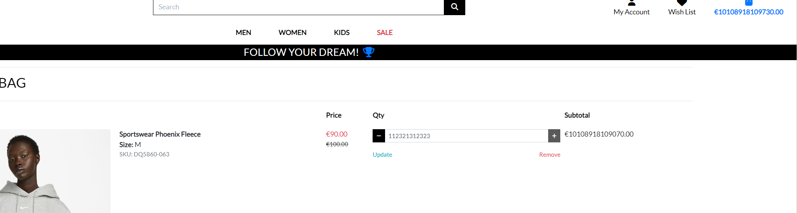

  - #### Fix:

    - The problem was solved by adding an additional form check and if the user tries to enter a number greater than 99, the system will automatically change this number to the maximum allowed, namely 99.

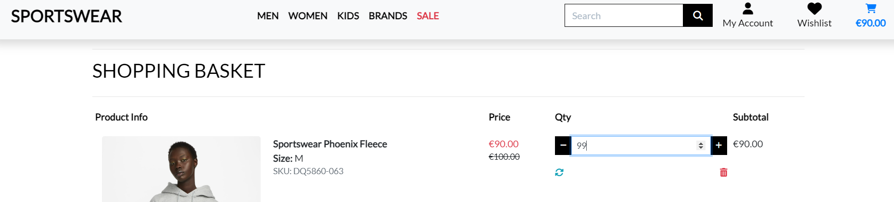

<br>


### When deleting a product from the database, access to the site was lost

  - #### Issue:

    - After deleting a product from the database, access to the site was lost for no reason. It was not even possible to log into the admin panel.

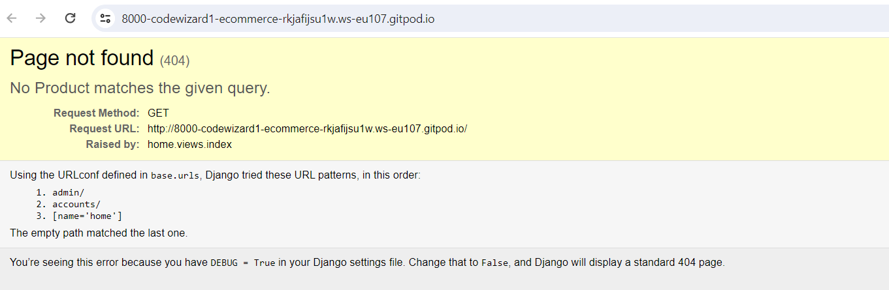

  - #### Fix:

    - After a long search for a solution to the problem, I tried resetting cookies using developer tools (DevTools). This helped solve the problem and the site became available again.

<br>

[Back to Top](#table-of-contents)

<br>

### When connecting Webhooks to the Stripe control panel, problems were identified with payment_intent.succeeded 

  - #### Issue:

    - When connecting Webhooks to the Stripe control panel, problems were identified with payment_intent.succeeded, which indicated incorrect processing of successful payments or possible technical problems in the process of interaction with the Stripe API.

    
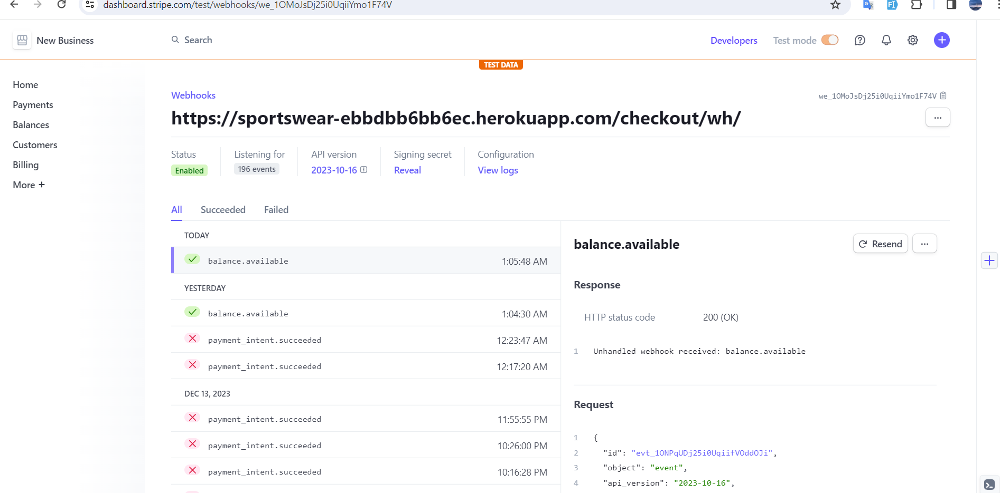

  - #### Fix:

    - The reason for this error lay in different versions of Python in the environment in which I worked and on Heroku when deploying the project. The solution to the problem was to add a runtime.txt file to the root of the project, which indicated which version of Python Heroku should use when deploying the project.

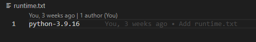

<br>

[Back to Top](#table-of-contents)

<br>

# Credits 

## Below is a list of sources of information that helped me and inspired me with their ideas:


- [Boutique Ado Walkthrough Project](https://learn.codeinstitute.net/courses/course-v1:CodeInstitute+EA101+2021_T1/courseware/eb05f06e62c64ac89823cc956fcd8191/3adff2bf4a78469db72c5330b1afa836/)
- [I Think Therefore I Blog Walkthrough Project](https://learn.codeinstitute.net/courses/course-v1:CodeInstitute+FSD101_WTS+2023_Q3/courseware/56a2da0940b4411d8a38c2b093a22c60/4565659a34d648b8b8edd063c3182180/)
- [Tasks Walkthrough Project](https://learn.codeinstitute.net/courses/course-v1:CodeInstitute+DB101+2021_T1/courseware/c0c31790fcf540539fd2bd3678b12406/6e44128b0b37416ab40c1a87ef2cb32a/)
- [Retro Reboot - Portfolio Project 5](https://github.com/adamgilroy22/retro-reboot/tree/main)
- [LevelUp! Loot](https://github.com/VictoriaT87/level_up_loot_vt/tree/main)
- [stackoverflow.com - How to implement Add to WishList for a Product in Django?](https://stackoverflow.com/questions/56580696/how-to-implement-add-to-wishlist-for-a-product-in-django)
 - [stackoverflow.com - Filter in the template if the product is in wishlist or no. Django ecommerce website](https://stackoverflow.com/questions/71248375/filter-in-the-template-if-the-product-is-in-wishlist-or-no-django-ecommerce-web)
- [Very Academy YouTube - Creating a User Bookmark / Favourites Features](https://www.youtube.com/watch?v=H4QPHLmsZMU)
- [thenewboston Youtube - Django Tutorial for Beginners - Favorite View Function](https://www.youtube.com/watch?v=irH98-4eKmQ)
- [Freecodecamp.org, An Introduction to Unit Testing in Python](https://www.freecodecamp.org/news/an-introduction-to-testing-in-python) 
- [Real Python.com, Getting Started With Testing in Python](https://realpython.com/python-testing/)
- [Stackoverflow.com, Django how to test model functions with validator](https://stackoverflow.com/questions/67331863/django-how-to-test-model-functions-with-validator)
- [Stackoverflow.com, Is it possible exclude test directories from coverage.py reports?](https://stackoverflow.com/questions/1628996/is-it-possible-exclude-test-directories-from-coverage-py-reports)
- [DjangoCon 2021 | Speed up your tests with setUpTestData | Adam Johnson](https://www.youtube.com/watch?v=_8qLxaWMdzE)
- [StackOverflow - How to add a unique randomly generated 6 digit key stored in a model](https://stackoverflow.com/questions/64850945/how-to-add-a-unique-randomly-generated-6-digit-key-stored-in-a-model)
- [StackOverflow - Delete Modal Loop Fix](https://stackoverflow.com/questions/66116509/bootstrap-modal-is-not-working-with-for-in-jinja-2)


<br>

[Back to Top](#table-of-contents)

<br>

### Deployment

The live deployed application can be found deployed on [Heroku](https://sportswear-ebbdbb6bb6ec.herokuapp.com/).

### ElephantSQL Database

This project uses [ElephantSQL](https://www.elephantsql.com) for the PostgreSQL Database.

To obtain your own Postgres Database, sign-up with your GitHub account, then follow these steps:
- Click **Create New Instance** to start a new database.
- Provide a name.
- Select the **Tiny Turtle (Free)** plan.
- You can leave the **Tags** blank.
- Select the **Region** and **Data Center** closest to you.
- Once created, click on the new database name, where you can view the database URL and Password.

### Amazon AWS

This project uses [AWS](https://aws.amazon.com) to store media and static files online, due to the fact that Heroku doesn't persist this type of data.

Once you've created an AWS account and logged-in, follow these series of steps to get your project connected.
Make sure you're on the **AWS Management Console** page.

#### S3 Bucket

- Search for **S3**.
- Create a new bucket, give it a name (matching your Heroku app name), and choose the region closest to you.
- Uncheck **Block all public access**, and acknowledge that the bucket will be public (required for it to work on Heroku).
- From **Object Ownership**, make sure to have **ACLs enabled**, and **Bucket owner preferred** selected.
- From the **Properties** tab, turn on static website hosting, and type `index.html` and `error.html` in their respective fields, then click **Save**.
- From the **Permissions** tab, paste in the following CORS configuration:

	```shell
	[
		{
			"AllowedHeaders": [
				"Authorization"
			],
			"AllowedMethods": [
				"GET"
			],
			"AllowedOrigins": [
				"*"
			],
			"ExposeHeaders": []
		}
	]
	```

- Copy your **ARN** string.
- From the **Bucket Policy** tab, select the **Policy Generator** link, and use the following steps:
	- Policy Type: **S3 Bucket Policy**
	- Effect: **Allow**
	- Principal: `*`
	- Actions: **GetObject**
	- Amazon Resource Name (ARN): **paste-your-ARN-here**
	- Click **Add Statement**
	- Click **Generate Policy**
	- Copy the entire Policy, and paste it into the **Bucket Policy Editor**

		```shell
		{
			"Id": "Policy1234567890",
			"Version": "2012-10-17",
			"Statement": [
				{
					"Sid": "Stmt1234567890",
					"Action": [
						"s3:GetObject"
					],
					"Effect": "Allow",
					"Resource": "arn:aws:s3:::your-bucket-name/*"
					"Principal": "*",
				}
			]
		}
		```

	- Before you click "Save", add `/*` to the end of the Resource key in the Bucket Policy Editor (like above).
	- Click **Save**.
- From the **Access Control List (ACL)** section, click "Edit" and enable **List** for **Everyone (public access)**, and accept the warning box.
	- If the edit button is disabled, you need to change the **Object Ownership** section above to **ACLs enabled** (mentioned above).

#### IAM

Back on the AWS Services Menu, search for and open **IAM** (Identity and Access Management).
Once on the IAM page, follow these steps:

- From **User Groups**, click **Create New Group**.
	- Suggested Name: `group-retro-reboot` (group + the project name)
- Tags are optional, but you must click it to get to the **review policy** page.
- From **User Groups**, select your newly created group, and go to the **Permissions** tab.
- Open the **Add Permissions** dropdown, and click **Attach Policies**.
- Select the policy, then click **Add Permissions** at the bottom when finished.
- From the **JSON** tab, select the **Import Managed Policy** link.
	- Search for **S3**, select the `AmazonS3FullAccess` policy, and then **Import**.
	- You'll need your ARN from the S3 Bucket copied again, which is pasted into "Resources" key on the Policy.

		```shell
		{
			"Version": "2012-10-17",
			"Statement": [
				{
					"Effect": "Allow",
					"Action": "s3:*",
					"Resource": [
						"arn:aws:s3:::your-bucket-name",
						"arn:aws:s3:::your-bucket-name/*"
					]
				}
			]
		}
		```
	
	- Click **Review Policy**.
	- Suggested Name: `policy-retro-reboot` (policy + the project name)
	- Provide a description:
		- "Access to S3 Bucket for retro-reboot static files."
	- Click **Create Policy**.
- From **User Groups**, click your "group-retro-reboot".
- Click **Attach Policy**.
- Search for the policy you've just created ("policy-retro-reboot") and select it, then **Attach Policy**.
- From **User Groups**, click **Add User**.
	- Suggested Name: `user-retro-reboot` (user + the project name)
- For "Select AWS Access Type", select **Programmatic Access**.
- Select the group to add your new user to: `group-retro-reboot`
- Tags are optional, but you must click it to get to the **review user** page.
- Click **Create User** once done.
- You should see a button to **Download .csv**, so click it to save a copy on your system.
	- **IMPORTANT**: once you pass this page, you cannot come back to download it again, so do it immediately!
	- This contains the user's **Access key ID** and **Secret access key**.
	- `AWS_ACCESS_KEY_ID` = **Access key ID**
	- `AWS_SECRET_ACCESS_KEY` = **Secret access key**

#### Final AWS Setup

- If Heroku Config Vars has `DISABLE_COLLECTSTATIC` still, this can be removed now, so that AWS will handle the static files.
- Back within **S3**, create a new folder called: `media`.
- Select any existing media images for your project to prepare them for being uploaded into the new folder.
- Under **Manage Public Permissions**, select **Grant public read access to this object(s)**.
- No further settings are required, so click **Upload**.

### Stripe API

This project uses [Stripe](https://stripe.com) to handle the ecommerce payments.

Once you've created a Stripe account and logged-in, follow these series of steps to get your project connected.

- From your Stripe dashboard, click to expand the "Get your test API keys".
- You'll have two keys here:
	- `STRIPE_PUBLIC_KEY` = Publishable Key (starts with **pk**)
	- `STRIPE_SECRET_KEY` = Secret Key (starts with **sk**)

As a backup, in case users prematurely close the purchase-order page during payment, we can include Stripe Webhooks.

- From your Stripe dashboard, click **Developers**, and select **Webhooks**.
- From there, click **Add Endpoint**.
	- `https://sportswear-ebbdbb6bb6ec.herokuapp.com/checkout/wh/`
- Click **receive all events**.
- Click **Add Endpoint** to complete the process.
- You'll have a new key here:
	- `STRIPE_WH_SECRET` = Signing Secret (Wehbook) Key (starts with **wh**)

### Gmail API

This project uses [Gmail](https://mail.google.com) to handle sending emails to users for account verification and purchase order confirmations.

Once you've created a Gmail (Google) account and logged-in, follow these series of steps to get your project connected.

- Click on the **Account Settings** (cog icon) in the top-right corner of Gmail.
- Click on the **Accounts and Import** tab.
- Within the section called "Change account settings", click on the link for **Other Google Account settings**.
- From this new page, select **Security** on the left.
- Select **2-Step Verification** to turn it on. (verify your password and account)
- Once verified, select **Turn On** for 2FA.
- Navigate back to the **Security** page, and you'll see a new option called **App passwords**.
- This might prompt you once again to confirm your password and account.
- Select **Mail** for the app type.
- Select **Other (Custom name)** for the device type.
	- Any custom name, such as "Django"
- You'll be provided with a 16-character password (API key).
	- Save this somewhere locally, as you cannot access this key again later!
	- `EMAIL_HOST_PASS` = user's 16-character API key
	- `EMAIL_HOST_USER` = user's own personal Gmail email address

### Heroku Deployment

This project uses [Heroku](https://www.heroku.com), a platform as a service (PaaS) that enables developers to build, run, and operate applications entirely in the cloud.

Deployment steps are as follows, after account setup:

- Select **New** in the top-right corner of your Heroku Dashboard, and select **Create new app** from the dropdown menu.
- Your app name must be unique, and then choose a region closest to you (EU or USA), and finally, select **Create App**.
- From the new app **Settings**, click **Reveal Config Vars**, and set your environment variables.

| Key | Value |
| --- | --- |
| `AWS_ACCESS_KEY_ID` | user's own value |
| `AWS_SECRET_ACCESS_KEY` | user's own value |
| `DATABASE_URL` | user's own value |
| `DISABLE_COLLECTSTATIC` | 1 (*this is temporary, and can be removed for the final deployment*) |
| `EMAIL_HOST_PASS` | user's own value |
| `EMAIL_HOST_USER` | user's own value |
| `SECRET_KEY` | user's own value |
| `STRIPE_PUBLIC_KEY` | user's own value |
| `STRIPE_SECRET_KEY` | user's own value |
| `STRIPE_WH_SECRET` | user's own value |
| `USE_AWS` | True |

Heroku needs two additional files in order to deploy properly.
- requirements.txt
- Procfile

You can install this project's **requirements** (where applicable) using:
- `pip3 install -r requirements.txt`

If you have your own packages that have been installed, then the requirements file needs updated using:
- `pip3 freeze --local > requirements.txt`

The **Procfile** can be created with the following command:
- `echo web: gunicorn app_name.wsgi > Procfile`
- *replace **app_name** with the name of your primary Django app name; the folder where settings.py is located*

For Heroku deployment, follow these steps to connect your own GitHub repository to the newly created app:

Either:
- Select **Automatic Deployment** from the Heroku app.

Or:
- In the Terminal/CLI, connect to Heroku using this command: `heroku login -i`
- Set the remote for Heroku: `heroku git:remote -a app_name` (replace *app_name* with your app name)
- After performing the standard Git `add`, `commit`, and `push` to GitHub, you can now type:
	- `git push heroku main`

The project should now be connected and deployed to Heroku!

### Local Deployment

This project can be cloned or forked in order to make a local copy on your own system.

For either method, you will need to install any applicable packages found within the *requirements.txt* file.
- `pip3 install -r requirements.txt`.

You will need to create a new file called `env.py` at the root-level,
and include the same environment variables listed above from the Heroku deployment steps.

Sample `env.py` file:

```python
import os

os.environ.setdefault("AWS_ACCESS_KEY_ID", "user's own value")
os.environ.setdefault("AWS_SECRET_ACCESS_KEY", "user's own value")
os.environ.setdefault("DATABASE_URL", "user's own value")
os.environ.setdefault("EMAIL_HOST_PASS", "user's own value")
os.environ.setdefault("EMAIL_HOST_USER", "user's own value")
os.environ.setdefault("SECRET_KEY", "user's own value")
os.environ.setdefault("STRIPE_PUBLIC_KEY", "user's own value")
os.environ.setdefault("STRIPE_SECRET_KEY", "user's own value")
os.environ.setdefault("STRIPE_WH_SECRET", "user's own value")

# local environment only (do not include these in production/deployment!)
os.environ.setdefault("DEBUG", "True")
```

Once the project is cloned or forked, in order to run it locally, you'll need to follow these steps:
- Start the Django app: `python3 manage.py runserver`
- Stop the app once it's loaded: `CTRL+C` or `⌘+C` (Mac)
- Make any necessary migrations: `python3 manage.py makemigrations`
- Migrate the data to the database: `python3 manage.py migrate`
- Create a superuser: `python3 manage.py createsuperuser`
- Load fixtures (if applicable): `python3 manage.py loaddata file-name.json` (repeat for each file)
- Everything should be ready now, so run the Django app again: `python3 manage.py runserver`

If you'd like to backup your database models, use the following command for each model you'd like to create a fixture for:
- `python3 manage.py dumpdata your-model > your-model.json`
- *repeat this action for each model you wish to backup*

#### Cloning

You can clone the repository by following these steps:

1. Go to the [GitHub repository](https://github.com/CodeWizard-1/e-commerce) 
2. Locate the Code button above the list of files and click it 
3. Select if you prefer to clone using HTTPS, SSH, or GitHub CLI and click the copy button to copy the URL to your clipboard
4. Open Git Bash or Terminal
5. Change the current working directory to the one where you want the cloned directory
6. In your IDE Terminal, type the following command to clone my repository:
	- `git clone https://github.com/CodeWizard-1/e-commerce.git`
7. Press Enter to create your local clone.

Alternatively, if using Gitpod, you can click below to create your own workspace using this repository.

[](https://gitpod.io/new#https://github.com/CodeWizard-1/e-commerce)

Please note that in order to directly open the project in Gitpod, you need to have the browser extension installed.
A tutorial on how to do that can be found [here](https://www.gitpod.io/docs/configure/user-settings/browser-extension).

#### Forking

By forking the GitHub Repository, we make a copy of the original repository on our GitHub account to view and/or make changes without affecting the original owner's repository.
You can fork this repository by using the following steps:

1. Log in to GitHub and locate the [GitHub Repository](https://github.com/CodeWizard-1/e-commerce)
2. At the top of the Repository (not top of page) just above the "Settings" Button on the menu, locate the "Fork" Button.
3. Once clicked, you should now have a copy of the original repository in your own GitHub account!

# Acknowledgements

I would like to express my sincere gratitude to my mentor Mitko Bachvarov for his incredible support and assistance in my learning process.
I would also like to express my gratitude to all the staff of the Code Institute for the excellent organization of the educational process.
It is equally important to express gratitude to your classmates. Your knowledge, enthusiasm and willingness to support in difficult times made our training more productive and interesting.

[Back to Top](#table-of-contents)