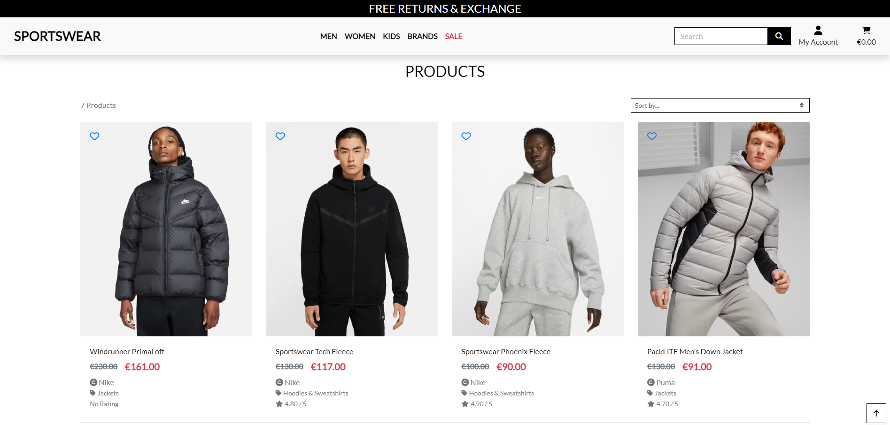
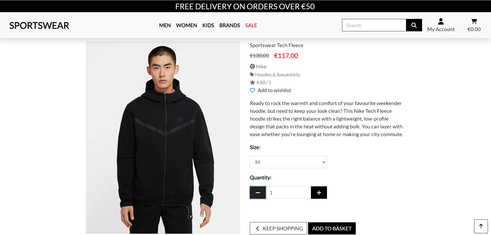
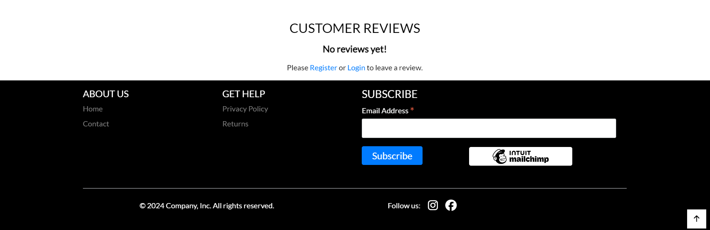
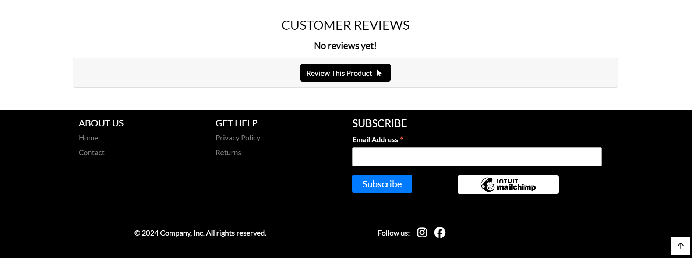
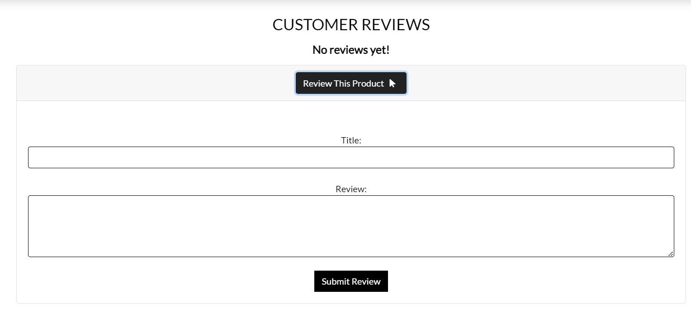
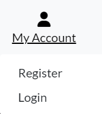

# Sportswear


Welcome to the Sportswear online store. This site was built using Django with custom Python, HTML, and CSS code for Code Institute P5 eCommerce apps. Our online store is an application that allows users to purchase clothes and accessories for sports as well as for everyday style.

Some features on the site are available exclusively to registered users, including viewing your order history, saving items to your wishlist, and adding product reviews.

Users can search for products, view product details, add to cart, and make payment. There is also a feedback page, a privacy policy and a section on returning goods.

[Live link to Sportswear](https://sportswear-ebbdbb6bb6ec.herokuapp.com/)


<br>

# Table of Contents

1. [UX](#ux)
2. [The Strategy Plane](#the-strategy-plane)
    * [Targeted Users](#targeted-users)
    * [Site Goals](#site-goals)
    * [Project Goals](#project-goals)
3. [Agile Planning](#agile-planning)
    * [User Stories](#user-stories)
4. [Fundamental Structure](#fundamental-structure)
    * [Wireframes](#wireframes)
    * [Database Schema](#database-schema) 
5. [The Scope Plane](#the-scope-plane)
6. [The Structure Plane](#the-structure-plane)
    * [Features](#features)
    * [Home Page](#home-page)
      * [Brands Section](#brands-section)
      * [Categories Section](#categories-section)
      * [Featured Products Section](#featured-products-section)
      * [Why Shop With Us Section](#why-shop-with-us-section)
      * [Footer](#footer)
    * [FAQs Page](#faqs-page)
    * [Contact Page](#contact-page)
    * [Pages Restricted to Login](#restricted-pages)
    * [Products](#products-page)
    * [Product Details](#product-details-page)
    * [Wishlist](#wishlist)
    * [My Profile](#profile-page)
    * [Cart Page](#cart-page)
    * [Checkout Page](#checkout-page)
    * [Admin Page](#admin-page)
    * [Future Features](#future-features)
7. [The Surface Plane](#the-surface-plane)
    * [Design](#design)
      * [Colour Scheme](#colour-scheme)
      * [Typography](#typography)
      * [Images](#images)
8. [Business Model](#business-model)
    * [Marketing Strategy](#marketing-strategy)
      * [Social Media Marketing](#social-media-marketing)
      * [Newsletter Marketing](#newsletter-marketing)
    * [SEO](#search-engine-optimization-seo)
      * [Keywords](#keywords)
      * [SiteMap](#sitemapxml)
      * [Robots](#robotstxt)
9. [Technologies](#technologies)
    * [Languages Used](#languages-used)
    * [Libraries And Frameworks](#libraries-and-frameworks)
    * [Tools and Resources](#tools-and-resources)
10. [Testing](#testing)
    * [Validator Testing](#validator-testing)
    * [Other Testing](#other-testing)
11. [Bugs Found and Fixed](#bugs-found-and-fixed)
    * [Bugs Not Fixed](#bugs-not-fixed)
12. [Credits And Sources](#credits-and-sources)
13. [Deployment](#deployment)
14. [Acknowledgements](#acknowledgements)

<br>

# UX

## The Strategy Plane

### Targeted Users

- Users looking to browse and purchase high-quality sportswear.
- Users seeking the latest arrivals in sportswear from top brands.
- Sports enthusiasts and those interested in an active lifestyle, curious about trends in the world of sports fashion.

### Site Goals

- Enabling users to swiftly and effortlessly search for products.
- Facilitating quick and easy product purchases for users.
- Providing users with the option to create an account to store their Wishlist and view their order history.
- Allowing users to conveniently edit their saved address for streamlined purchasing.
- Offering users the ability to contact the business online.

### Project Goals

- Develop a polished and functional e-commerce website.
- Incorporate comprehensive features for a professional online store experience.
- Apply knowledge gained from previous projects to make this website more advanced.
- Introduce new elements, such as a wishlist and user reviews, to enhance CRUD functionality.
- Ensure a user-friendly interface for easy navigation and a seamless shopping experience.

<br>

[Back to Top](#table-of-contents)

<br>

## **Agile Planning**

My project followed an agile planning approach, breaking down each feature into user stories to align with user expectations. Each user story was meticulously planned, leading to the creation of multiple tasks dedicated to implementing specific features. These tasks were then grouped into epics.

To prioritize development efforts, features were categorized as Must Have, Should Have, Could Have, and Won't Have. This classification helped determine the importance of each feature.

The product section took precedence as the primary focus of the website, receiving the most attention and time for completion. As the project progressed, additional tasks were introduced or modified to accommodate the evolving needs of users within the website.

The Project board [here](https://github.com/users/CodeWizard-1/projects/5).


[Back to Top](#table-of-contents)

<br>

## User Stories

* Based on the collected and studied user stories, a project implementation plan was developed.
You can read user stories [here](https://github.com/CodeWizard-1/e-commerce/issues?q=is%3Aissue+is%3Aclosed).


* Each user story was assigned a point value based on the complexity of implementation. Using the MoSCoW principle (Must Have, Should Have, Could Have, Won't Have), iterations were planned for the implementation of the identified tasks.

You can read milestones [here](https://github.com/CodeWizard-1/e-commerce/milestones?state=closed).


<br>

[Back to Top](#table-of-contents)

<br>


## Fundamental Structure

### Wireframes

- To facilitate the design of the website, I created wireframes for every page. Adhering to best practices, wireframes were crafted for mobile and desktop dimensions. Balsamiq was employed as the tool for creating the site's wireframes.

### Home Page Wireframes

<details>
<summary>Click to View Home Page wireframes</summary>

#### Mobile


#### Desktop


</details>

### All Products Page Wireframes

<details>
<summary>Click to View All Products Page wireframes</summary>

#### Mobile


#### Desktop


</details>

### Product Detail Page Wireframes

<details>
<summary>Click to View Product Detail Page wireframes</summary>

#### Mobile


#### Desktop


</details>

### Basket Page Wireframes

<details>
<summary>Click to View Basket Page wireframes</summary>

#### Mobile


#### Desktop


</details>

### Checkout Page Wireframes

<details>
<summary>Click to View Checkout Page wireframes</summary>

#### Mobile


#### Desktop


</details>


### Contact Page Wireframes

<details>
<summary>Click to View Contact Page wireframes</summary>

#### Mobile


#### Desktop


</details>

### Wishlist Page Wireframes

<details>
<summary>Click to View Wishlist Page wireframes</summary>

#### Mobile


#### Desktop


</details>

### Edit Reviews Wireframes

<details>
<summary>Click to View Edit Reviews wireframes</summary>

#### Mobile


#### Desktop


</details>


### Database Schema

- I created an entity relationship diagram using  [Drawsql.app](https://drawsql.app/). This allowed me to visually represent the connections between my data structures and streamlined the development process significantly. Now, I have a visual guide, making it much easier to understand and interact with my data.


[Back to Top](#table-of-contents)

<br>

## The Scope Plane
- Designing a homepage featuring a compelling hero images that instantly communicates the website's purpose to users.
- Implementing account registration to enable restricted access for editing and deleting reviews, managing wishlists, and saving user information for faster checkouts in the future.
- Developing a fully responsive website, ensuring seamless functionality across all screen sizes, with optimized navigation for mobile users.
- Empowering superusers with the capability to create, view, update, and delete reviews for both users and products.

<br>

[Back to Top](#table-of-contents)

<br>

## The Structure Plane

# Features 

## Existing Features

### Home Page

The Home page of the online store is an attractive and informative landing page, created to attract attention and comfortably guide users.

<br>

[Back to Top](#table-of-contents)

<br>


### Featured Products Section

- The "Trending This Week" section will showcase a random list of 5 products marked as "Is_Featured" on the admin panel.
- Each product is presented with a card displaying its details, price, and whether it is currently on sale

<br>

[Back to Top](#table-of-contents)

<br>

### Healthy Lifestyle and Sporty Fashion Section

- This section serves as an introduction to the online store's commitment to promoting a healthy lifestyle through sporty fashion.

<br>

[Back to Top](#table-of-contents)

### Footer

- The footer is consistently present on every page, featuring links to Contact, Returns, Privacy Policies, and an email address.
- Additionally, the footer incorporates our newsletter signup, powered by MailChimp. This ensures its visibility on every page, maximizing the likelihood of visitors subscribing.


<br>

[Back to Top](#table-of-contents)

<br>

### Returns Page


- The product returns page provides detailed information about the return policy of the online store
<br>

[Back to Top](#table-of-contents)

<br>

### Contact Page

- On the contact page, concise information is presented using small icons for quick and easy comprehension, including a phone number, address, and email.
- Additionally, the page includes a contact form enabling users to reach out to the business. The information submitted through this form is stored in the Admin panel, ensuring easy access for staff to review.

<br>

[Back to Top](#table-of-contents)

<br>

### Privacy Policy

- A privacy policy is a legal document that describes how a website collects, uses, discloses and manages the personal information of its users or customers. It contains information about the types of data collected, the purposes for collecting it, storage and security methods, and the rights of users regarding their personal information.

<br>

[Back to Top](#table-of-contents)

<br>

### Main Nav Menu


- Throughout the site, the user has access to the main navigation menu. Features include a search bar, account/profile access, cart link and subtotal if the user has added items to their carts, as well as links to filter products by gender, brand and sale page. Once logged in, users have access to the wishlist page.

<!--  -->

<br>

[Back to Top](#table-of-contents)

<br>

### Restricted Pages


- Certain pages are accessible only to users who have logged in. Links to these pages are displayed in the Navbar exclusively when a user is logged in.
- The Wishlist feature is reserved solely for users who have registered an account.

<br>

[Back to Top](#table-of-contents)

<br>

### Product Filtration




- Through the navigation menu, the user can sort and filter products. All products can be selected by gender, brand, as well as products for children. In the subcategory, you can choose from the presented clothing categories. There is also a separate page with products at a reduced price for a more convenient search for the product by the user.

<br>

[Back to Top](#table-of-contents)

<br>

### Search Bar


- Users can use the search bar in the navigation menu to find specific products. The search term is matched with the product name and description to provide the user with a list of products that match their search query.
The user can also see how many results were returned for their search query.
If the user clicks the search button without entering anything, an error message is displayed.

<br>

[Back to Top](#table-of-contents)

<br>


### Product Details Page

- Product details page displays product image, name, regular price, discount price (if available), brand, category, rating, option to add to wishlist, product description, option to select size (if available), select quantity and user can add product to cart.
- The page also displays reviews left by users, with the option for authorized users to leave their own.
- Reviews can be updated or deleted by the user who left them or by the administrator/superuser. These are all CRUD functions.


- If the user is not authorized, he is prompted to log into his account or register.



- If the user is authorized, he can click on “Review this product” to write a review.
 


- A window will open below in which the user can specify a topic and leave a review.



- After writing a review and sending it, the user will see a success message.


- If necessary, the user can update his review.


- After updating the review, the user will see a success message.


- If the user decides to delete a review, he will also be informed about the successful action in the message


<br>

[Back to Top](#table-of-contents)

<br>

### Wishlist Page

- The Wishlist page allows users to get a list of all the products they have added to their wishlist by clicking the heart icon on each product.
- The Wishlist page provides a brief description of the product as well as a link to the product detail page that allows users to add it to their cart.
- The page also has a delete option that allows users to remove a product from their wishlist - again, this is done using the CRUD function.

- If the user has not added any product to the wishlist, he will see the message below.


- To add a product to your wishlist, you need to click on the heart icon on the page with the product description or on the page with the total quantity of the product.


- After successfully adding a product, the heart icon will change color and an additional message will appear.


- If you click on the heart icon again, the item will be removed from your wishlist and there will be an additional message about it.


- On the wishlist page itself, you can click on the binoculars icon to go to the product page.


- You can remove a product from your wish list by clicking on the product removal icon, and if you want to remove the entire product from the list, you need to click on the “CLEAR WISHLIST” sign at the top.


<br>

[Back to Top](#table-of-contents)

<br>

### My Account Dropdown

- If the user is logged in, the My Account drop-down in the navigation menu will contain a link to the user's profile.
- If the user is not logged in, they will be given the option to either register for an account or log into an existing account.
- If the user is logged in and has administrator rights, he will see an additional menu "Product Management"




- If the user is logged in and has admin permissions, they can add new products to the site from the admin dropdown in the nav menu.
- The add product page contains a form for the admin to fill out with the details of the new product.


- If the user is logged in and has admin permissions, they can edit site products by clicking the edit icon on either the product card on the all products page or the individual product page.
- The edit product page contains the same form as the add product page but the fields are already populated with the product's current data.


- If the user is logged in and has admin permissions, they can delete site products by clicking the delete icon on either the product card on the all products page or the individual product page.


<br>

[Back to Top](#table-of-contents)

<br>

### User Sign Up Page

- Users without an account can register by clicking the "Register" link in the main navigation menu. They will be given a form to add their details and create a profile for that user upon completion.


- Users are sent a confirmation email to complete account registration

<br>

[Back to Top](#table-of-contents)

<br>

### User Sign In Page


- If the user is not logged into the site but has a profile, they can click on the login link where they will be presented with a login page. To do this, they must enter their username or email address and the correct password. There is also a checkbox to remember the user on their current device to avoid having to log in every time they visit the site.


<br>

[Back to Top](#table-of-contents)

<br>

### User Sign Out Page


- If the user is not logged into the site but has a profile, they can click on the login link where they will be presented with a login page. To do this, they must enter their username or email address and the correct password. There is also a checkbox to remember the user on their current device to avoid having to log in every time they visit the site.


<br>

[Back to Top](#table-of-contents)

<br>

### User Profile Page


- When the user has completed registration on the site, he is provided with a profile. The profile contains information about the default delivery address, if one is set, and a list of the user's previous orders.


- There is a form in the user's profile that contains default delivery information if the user has saved it. The user can update this information from their profile by editing the form and clicking the "Update Information" button. This information will be automatically used the user's next purchase to make the site more convenient for customers.


- Users can view a list with complete order history in their profiles. The data is displayed in a table, each row of which contains the order number, time and date of purchase, items included in the order, and the total amount of each order.
- The order number contains a link that, when clicked, takes the user to the order confirmation page for that specific order containing all the details about that order, as well as a link to return to the user's profile.

<br>

[Back to Top](#table-of-contents)

<br>


### Basket Page

- The basket can be accessed from the main navigation menu.
The menu displays the running total of items in the user's basket.
When the user clicks on this, they can see all the items in their basket, the individual price of each product, a subtotal for the product if the quantity is greater than 1, and a quantity switch for each product with buttons to update the quantity or remove the product entirely from your basket.


- If the user has nothing in their basket, a message will appear prompting the user to continue shopping


- Similar to the quantity selector on an individual product page, users can adjust the quantity of a product already in their basket.
- From here, the user can add a maximum quantity of 99 items to the cart in the same way as on the individual product page. Or it can be removed from the basket.


- This is the amount that the user’s cart will be after adding up all the products and their quantities.
- Under the cart amount, the user can see the shipping cost. If the value of the basket exceeds 50 euros, delivery is free, otherwise it is calculated as 10% of the order amount.


- Once the total is calculated, users will see two buttons: one to continue shopping and one to proceed to checkout.


<br>

[Back to Top](#table-of-contents)

<br>

### Checkout Page


- The final step in a user's shopping journey on a website is the checkout page.
- This page contains a form for the user's shipping and payment information, as well as a summary of the user's order.
- If a user has an account on the site, they can save shipping information to their profile so that it is automatically filled in when placing an order.


- When placing an order, the user can add their details and, if logged in, check the box to save their details for future transactions.
- Users must enter their payment information before completing checkout, and all payments are processed through Stripe.


- The final summary of the user's order is displayed, containing all of the user's cart items, the quantity, and the running total for each item.
- The user can also see the order total, shipping costs, any discounts applied, and the total in a summary.


- At the very end of placing an order, the user will see two buttons: one for setting up a cart, the other for placing an order.
- The total amount is displayed below the order completion button to further inform the user of how much will be charged to their card once the order is completed.


- Once the order is completed and payment has been received, the user will receive an order confirmation email containing the order number and a receipt showing the total payment amount.


- Once the order is completed, the user is redirected to a confirmation page informing them that an order confirmation email has been sent to the provided email address.
- This page contains the final description of the order and what the user purchased.
- This page can be accessed again from the user's profile if they have an account on the site by clicking on the order number in the list of past orders.


<br>

[Back to Top](#table-of-contents)

<br>

### Error Page
![Error Page Image]
- If a user lands on a page that either doesn't exist or that they shouldn't be on (a regular user using links on an admin page or trying to edit/delete something from a link), they will be shown an error message. . page with a button to return them to the store.

<br>

[Back to Top](#table-of-contents)

<br>

## Future Features

- There are a few features I would like to add to the website, given more time. Currently the product ratings are just random numbers entered when the product is being added (initally with a fixtures file) but I would like for users to also be able to add a product rating too which is caluclated as an average. 
- Currently, the coupons can be added any number of times - there is no limit for one use per customer. I tried to implement that to no success. More information about it can be found in the [Bugs Section](#bugs-not-fixed)

<br>

[Back to Top](#table-of-contents)


## The Surface Plane
## Design
### Colour Scheme
 -  The colour scheme was designed so that while it stands out as a bright interface, the colours also don't distract from the product images, as these are the main point of the website.
 - For this I chose a blue to stand out on the white background - they compliment each other well enough without one being overly distracting from the other.


### Typography
 -   The font chosen for the website is a font called Fjalla One. This was picked because it is very easy to read with a medium contrast but it also has a somewhat fantasy feel to it, in fitting with the expected user base of people who like Pop Culture. I wanted the typography to compliment the website, not overpower what it was saying. The font was found on [Google Font](https://fonts.google.com/specimen/Fjalla+One) and imported to the website with a CSS import.

### Images
- All product images were taken from their respective brands websites, as well as some from [Gamestop](https://www.gamestop.com/).

<br>

[Back to Top](#table-of-contents)

<br>

## **Business Model**

This website follows a Business to Customer model - it sells products related to Pop Culture directly to the customer. The website has been built for quick checkout for both registered and unregistered users, with extra features available to users who have signed up to the website, as well as users who subscribe to the newsletter.

[Back to Top](#table-of-contents)

## **Marketing Strategy**

### **Social Media Marketing**

A mockup design of a Facebook page is included. The main goal of this Facebook page would be to showcase new deals on products, give coupon code discounts to followers, and have targeted ads for different times of the year - "End of School Sale", "Christmas Sale", "New Season of X Show Starting Soon" etc.


### **Newsletter Marketing**

The website has an embedded [Mailchimp](https://mailchimp.com/?currency=EUR) newsletter in the footer, as well as a pop-up form for the first visit. The reason for both would be to allow users who return to sign up, even after they have dismissed the inital pop-up. The campaign sends out a custom thank you email with a discount code to encourage users to subscribe.

This newsletter can in turn be used by the site owner to send subscribers emails on the latest products, deals, and discounts available.


[Back to Top](#table-of-contents)

## **Search Engine Optimization (SEO)**

### **Keywords**

For finding meta keywords for the website, I used [Wordtracker](https://www.wordtracker.com/search). The keywords were chosen based on their performance and volume, as the competition stat wasn't show for the majority of the keywords.


### **Sitemap.xml**

I created a sitemap using [XML-Sitemaps](https://www.xml-sitemaps.com) on my live website [https://levelup-loot-vt.herokuapp.com/](https://levelup-loot-vt.herokuapp.com/)

The XML that was created is in the root directory of the website.

### **Robots.txt**

The robots.txt file was created using this guide [https://www.conductor.com/academy/robotstxt/](https://www.conductor.com/academy/robotstxt/).


[Back to top](#table-of-contents)

<br>

# Technologies

## Languages Used
* [HTML5](https://en.wikipedia.org/wiki/HTML5)
* [CSS3](https://en.wikipedia.org/wiki/Cascading_Style_Sheets)
* [Javascript](https://en.wikipedia.org/wiki/JavaScript)
* [Python](https://en.wikipedia.org/wiki/Python_(programming_language))

## Frameworks Used

* [Django](https://www.djangoproject.com/)
* [Bootstrap](https://blog.getbootstrap.com/) 

## Libraries And Installed Packages

* [coverage](https://pypi.org/project/django-coverage/) - Used for running automated tests.
* [pytest](https://docs.pytest.org/en/7.2.x/) - Used for running automated tests.
* [pytest-cov](https://pypi.org/project/pytest-cov/) - Used for running automated tests.
* [crispy-bootstrap4](https://pypi.org/project/crispy-bootstrap4/) - Template pack used for django-crispy-forms
* [django-crispy-forms](https://pypi.org/project/crispy-bootstrap4/) - Used to render forms throughout the project.
* [dj-database-url](https://pypi.org/project/dj-database-url/) - A package used to utilize DATABASE_URL environment variable.
* [dj3-cloudinary-storage](https://pypi.org/project/dj3-cloudinary-storage/) - Facilitates integration with Cloudinary by implementing Django Storage API.  
* [django-allauth](https://django-allauth.readthedocs.io/en/latest/) - Allows authentication, registration and account management in Django.
* [django-countries, v7.2.1](https://pypi.org/project/django-countries/7.2.1/) - Django application used to provide country choices for use with forms, and a country field for models.
* [gunicorn](https://gunicorn.org/) - A Python WSGI HTTP Server for UNIX.
* [psycopg2](https://pypi.org/project/psycopg2/) - A PostgreSQL database adapter.
* [boto3==1.26.27](https://pypi.org/project/boto3/) - An Amazon Web Services (AWS) software development kit (SDK) used to connect to the S3 bucket
* [Black](https://pypi.org/project/black/) - A Python code formatter.
* [django storages](https://django-storages.readthedocs.io/en/latest/) - Collection of custom storage backends for Django.
* [Css Minifier](https://www.toptal.com/developers/cssminifier) - Minify CSS for better response time.

<br>

[Back to Top](#table-of-contents)

<br>

## Tools And Resources
* [GitPod](https://www.gitpod.io/)
* [GitHub](https://github.com/)
* [Heroku](https://heroku.com)
* [ElephantSQL](https://www.elephantsql.com/)
* [Cloudinary](https://cloudinary.com/)
* [ReadMe Template](https://github.com/Code-Institute-Solutions/readme-template)
* [Stack Overflow](https://stackoverflow.com/)
* [Coolors](https://coolors.co/)
* [AmIResponsive](https://ui.dev/amiresponsive)
* [Real Python](https://realpython.com/)
* [Online Convert](https://image.online-convert.com/convert-to-webp)
* [Pic Resize](https://picresize.com/)
* [Sideshow](https://www.sideshow.com/)
* [Hasbro](https://shop.hasbro.com/)
* [Darkhorse](https://www.darkhorsedirect.com/)
* [Gamestop](https://www.gamestop.com/)

<br>

[Back to Top](#table-of-contents)

<br>

# Testing 
### Validator Testing 

- HTML
  - No errors were returned when passing through the official [W3C validator](https://validator.w3.org/)
  - The only warnings that were given were because of the nature of Django Template Syntax.

- CSS
  - No errors were found when passing through the official [(Jigsaw) validator](https://jigsaw.w3.org/css-validator/)
  
- Python
  - No errors were returned when passing through [CI Python Linter](https://pep8ci.herokuapp.com/)
  - The only issue that was brought up by the Linter were some lines too long. As these were less than 5 characters and that code had already been formatted by the Black plugin, I left these alone.

<br>

### Lighthouse Testing
#### Desktop

- Testing on desktop initially resulted in a low Accessibility score of 87. This was due to the insufficient contrast ratio of the blue color I had originally chosen.
- To address this issue, I used a color contrast checker in Lighthouse and discovered that I needed to change the blue color to a darker shade.
- I also checked the colors used in the Categories section and realized that I needed to improve the contrast there as well. To resolve this, I added a drop shadow effect to the text.
- After implementing these fixes, the updated metrics showed significant improvements: 99 Performance, 98 Accessibility, 92 Best Practices, and 100 SEO.

- 
- 

<br>

#### Mobile

- On mobile, the performance score is 93. Initially, it was lower due to a cumulative layout shift (CLS) of 0.219. To address this, recommendations were provided to add width and height attributes to images and convert the images from .jpg to .webp format.
- To convert the images from .jpg to .webp, I used the [WEBP Converter](https://cloudconvert.com/webp-converter) website.
- Additionally, I changed the background image on the Hero section of the index page to a smaller version in order to mitigate the CLS issue.
- The main challenges with achieving a higher rating are related to Lighthouse's recommendation to use HTTP2, which is not within my control as the website is hosted on Heroku.
- There is also an issue related to "Reduced unused JavaScript," which specifically mentions Stripe, AWS, Mailchimp, and jQuery. Since these libraries are included in the base template and separating them would require significant time and effort, I have chosen to leave them as they are and provide screenshots as evidence.


| Page | Device | Category | Result |
|------|--------|----------|--------|
|Index | Mobile | Performance | 93% |
|||Accessibility| 98% |
|||Best Practice | 92% |
|||SEO | 100% |
|| Desktop | Performance | 100% |
||| Accessibility | 98% |
||| Best Practice | 92% |
||| SEO | 100% |
 <br>

 [Back to Top](#table-of-contents)

<br>

### Automated Testing
- I wrote tests for each app and for every view.py, model.py and form.py I have in the project. Below is the coverage report. Since my last project I have taken a keen interest in learning more about automated testing. Linked below are some of the resources I used to help me learn. Although the test still aren't comprehensive as I'd like and there are unfortunately some apps that I didn't even know how to begin to tackle (or if I should), I still managed to write 81 tests that all pass.

- For the SetUp methods, based on the video linked below from Adam Johnson, I used the class method. However, as I had previously learned to use the SetUp method, I reverted back to that as I didn't know the difference between the 2 versions and didn't want t confuse the code by having multiple ways for the same thing. 

#### Resources Used For Testing
- [DjangoCon 2021 | Speed up your tests with setUpTestData | Adam Johnson](https://www.youtube.com/watch?v=_8qLxaWMdzE)
- [Mozilla | Django Tutorial Part 10: Testing a Django web application](https://developer.mozilla.org/en-US/docs/Learn/Server-side/Django/Testing)
- [https://machinelearningmastery.com/ | A Gentle Introduction to Unit Testing in Python](https://machinelearningmastery.com/a-gentle-introduction-to-unit-testing-in-python/)
- [Real Python | Getting Started With Testing in Python](https://realpython.com/python-testing/)
- [DataQuest | A Beginner’s Guide to Unit Tests in Python (2023)](https://www.dataquest.io/blog/unit-tests-python/)

<br>


 

<br>

### Manual Testing
- Manual testing has been done extensively and has been shown in separate file, located [here.](documentation/testing.md)

### Other Testing
 - The website has been tested across various screen sizes, using the Chrome DevTools responsive device section, [Responsive Design Checker](https://responsivedesignchecker.com/) and by opening the website on Firefox, Chrome, 3 various sized Android phones (Huawei P20 Lite, OnePlus 9 Pro, Samsung Galaxy S20) and an Android tablet (Samsung Galaxy Tab 10). 
 - Here is a link to a separate [Markdown file](documentation/tested-devices.md) of device screenshots.

<br>

[Back to Top](#table-of-contents)

<br>

# Bugs

Below is a description of bugs encountered and how I was able to fix them or why I couldn't.

### Adding a blank quantity would throw a 500 error

  - #### Issue:

    - When Adding or Updating Products, if the quantity was blank or an empty string, a 500 server error would be thrown

  - #### Fix:

    - Initially I googled this and thought I might need to update the quantity_input_script.html to check for NaN (Not a Number). However, this seemed like it would be quite involved and I didn't think I would be able to make it work.
    - I then decided to check in the views for a validation. My views for add_to_cart and adjust_cart were updated with form validation and this works. The website now shows an error toast message if the quantity is blank.


<br>

### Adding an incorrect SKU throws a server error

  - #### Issue:

    - When Adding or Updating Products, the SKU could be any combination of letters or numbers and any length - resulting an error on form submission

  - #### Fix:

    - My inital thought was to add help-text to the model so that the form would tell the user what to write in the code. However, this didn't solve the issue that someone could intentionally or unintentionally still add an incorrect SKU and cause the same failure.
    - I then decided to have a SKU automatically generated when a new product was being added. This field pre-populates with a 6 digit code and is always unique. On top of that, I also made the field Read-Only on the Product Form, therefore it doesn't need to be touched by the admin and can't cause an issue.

 

<br>

[Back to Top](#table-of-contents)

<br>

  ### Delete Modal Not Deleting Correct Product ID

  - #### Issue:

    - When clicking on "Delete" on the all products page, the product ID for deletion would only point to the first product ID.

  - #### Fix:

    - This fix was actually quite easy in the end but it wasn't spotted for a long time, so thank you to [Sean Finn](https://github.com/seanf316/) my classmate for finding it.
    - The product cards on the product page were being rendered with a loop - , however I originally had the modal for deletion outside the loop. Therefore it rendered for the first product only. Moving the deletion modal into the loop, made sure that when clicking Delete, it was for the correct Product ID.

 

<br>

[Back to Top](#table-of-contents)

<br>

### User Editing and Deletion

  - #### Issue:

    - Any logged in user was able to delete another users profile by changing the URL PK number to another.

  - #### Fix:

    - This was a bug pointed out to me by a fellow student [Sean Johnston](https://github.com/seanj06/). I wouldn't have known to look for it myself so I'm very thankful.
    - I had LoginRequired Mixins on my edit and delete views for both appointments and profiles, however I didn't realise that would allow _any_ logged in user access to a different users account just by changing the PK in the URL for edit/delete.
    - Sean pointed me towards the UserPassesTestMixin and I was successfully able to implement this into my Views. Users now need to pass an ID check before they're allowed to access the Edit or Delete views for their own profile and they get a 403 Forbidden page if they try to access a different users profile.

<br>

[Back to Top](#table-of-contents)

<br>

### Reviews Can Be Updated By Any User, Multiple Reviews Allowed 

  - #### Issue:

    - Any user can update any other users review by changing the review ID in the update URL. Also, multiple reviews could be submitted by a user for the same product.

  - #### Fix:

    - I used CBVs for my Review forms - to allow updating and deleting. However, I originally only had the LoginRequiredMixin on these.
    - I needed to add the UserPassesTestMixin to these CBVs, so that only the original auther of the reviews could update or delete their own review.
    - For the reviews being 1 per user - I found this article on [StackOverflow](https://stackoverflow.com/questions/68135234/how-to-allow-users-to-rate-a-product-only-once), which allowed me to a UnqiueContraint to the review model.

<br>

[Back to Top](#table-of-contents)

<br>

### Wishlists

  - #### Issue:

    - The Wishlist would only allow 1 product to be added per user.

  - #### Fix:

    - The most trouble I had with this project seemed to be with the Wishlist. This particular issue was more to do with a misunderstanding of my models.
    - The original model I created for the wishlist used a ForiegnKey for both the user and the product. This meant that I could add 1 product to 1 user's Wishlist.
    - I also had an issue where a newly registered user would not have a Wishlist automatically created on account creation - so when that user tried to add a product to a wishlist, this would throw an error as a wishlist didn't exist. I originally thought to create a signal that would create the Wishlist, the same way the UserProfile would be created, however this seemed like it was an overcomplication of the issue.
    - To fix everything, I had a complete re-write of the Wishlist app. I changed the model from ForeignKeys to a ManyToManyField key for Products and a OneToOneField for the User.
    - For the views, I found these articles - [Django Docs](https://docs.djangoproject.com/en/4.2/ref/models/querysets/#get-or-create) and [https://www.queworx.com/django/django-get_or_create/](https://www.queworx.com/django/django-get_or_create/) - which would allow me to get_or_create a Wishlist for a user. Alongside the Try and Except statements, this would handle any error that might be created if a user did not currently have a Wishlist associated with their account ID.
    - However, on the actual template then, this was giving me the error "AttributeError::: 'tuple' object has no attribute 'products'" when trying to iterate over the Wishlist with  and .
    - I realised the get_or_create was creating a tuple, so I couldn't iterate over it with just the  syntax - I needed to check if the wishlist exists with products first and then I needed to access the products on the wishlist. This lead me to try  and  which worked. This - to my knowledge - was because the Wishlist itself was only a type of holder for many products. The wishlist itelf was 1 item - the products were what we needed to access.
    - I feel there was probably an easier way to achieve the same outcome - but this solution worked for me, it's being saved properly to the database and so was fit for purpose here.


<br>

[Back to Top](#table-of-contents)

<br>

# Bugs Not Fixed

### Coupon Codes

  - #### Issue:

    - Coupon codes can be used multiple times per user.

  - #### What I Tried:

    - For coupons, I only wanted a user to be able to use a coupon once and then they couldn't use it again on a new order but I couldn't get this to work.
    - I tried this from [StackOverflow](https://stackoverflow.com/questions/62359009/django-how-to-reduce-total-number-of-coupons-after-each-use) with my code being:
    ```
    def add_coupon(request):
    """ Allow a user to add the coupon code """

    code = request.POST.get('code')
    order = Order.objects.filter(user_profile__user=request.user).order_by('-date').first()
    now = timezone.now()
    coupon = Coupon.objects.filter(code__iexact=code, start_date__lte=now, expiry_date__gte=now).exclude(order=order, max_value__lte=F('used')).first()
    
    if not coupon:
        messages.error(request, 'You can\'t use the same coupon again, or the coupon does not exist')
        return redirect('checkout')
    else:
        try:
            coupon.used += 1
            coupon.save()
            order.coupon = coupon
            order.save()
            messages.success(request, "Successfully added the coupon")
        except Exception:
            messages.error(request, "Max level exceeded for the coupon")
        
        return redirect('checkout')

    ```
    - However I was unable to get this to work properly and so for time purposes, I just allowed the coupon code to stay as it is. If this was a project going into a real production, this would be a bug that would be a priority to fix.

<br>

### Submit button on contact form

  - #### Issue:

    - Have the Submit button dissapear from the contact form once submitted.

  - #### What I Tried: 

    - I would like the contact form to completely disappear on submission, instead of just the Submit button being left behind. This is something I looked into but adding an onclick through HTML/CSS wouldn't work because the button would still disappear if the form failed to send. This would mean the user needs to refresh the page to get the submit button to reappear.
    - I then tried to add javascript for a button click event but this prevented the submission message from being displayed after the successful submission. Adding javascript to hide the button on submission, would hide it when the form was invalid but still show it when the page rendered the success message.

<br>

### Whitespace Validation on Contact Form

- #### Issue:

    - Could not achieve full whitespace validation for forms.

- #### What I Tried: 

  - The contact form currently allows users to submit messages that aren't stripped, e.g "C C C". Looking into this, I found some answers which were to set the model fields to have "blank=False" and "null=False" but this didn't work. I then tried to clean the data on the field using the clean() method but again, this didn't work. [Trim whitespaces from charField](https://stackoverflow.com/questions/5043012/django-trim-whitespaces-from-charfield)
  - The fields do all have to be filled in or the form will fail to send with an error message explaing all fields must be filled in, this was the best I could achieve for the form currently.

<br>

[Back to Top](#table-of-contents)

<br>

# Credits and Sources

### Wishlist
- Getting the Wishlist system to worked needed several tutorials and articles:
  - [stackoverflow.com - How to implement Add to WishList for a Product in Django?](https://stackoverflow.com/questions/56580696/how-to-implement-add-to-wishlist-for-a-product-in-django)
  - [stackoverflow.com - Filter in the template if the product is in wishlist or no. Django ecommerce website](https://stackoverflow.com/questions/71248375/filter-in-the-template-if-the-product-is-in-wishlist-or-no-django-ecommerce-web)
  - [Very Academy YouTube - Creating a User Bookmark / Favourites Features](https://www.youtube.com/watch?v=H4QPHLmsZMU)
  - [thenewboston Youtube - Django Tutorial for Beginners - Favorite View Function](https://www.youtube.com/watch?v=irH98-4eKmQ)
  - [stackoverflow.com - Add products to favorite list](https://stackoverflow.com/questions/67493992/django-add-products-to-favorite-list)
  - [Trying to redirect the wishlist after product deletion - not implemented](https://forum.djangoproject.com/t/redirecting-user-to-page-after-login/14603/9)
  - [codemy YouTube - How To Modify The Django Admin Area](https://www.youtube.com/watch?v=_7Fi9dpw-ew)
  - [StackOverflow - Django Admin ManyToManyField](https://stackoverflow.com/questions/8043881/django-admin-manytomanyfield)
  - [earthly.dev - Customizing the Django Admin](https://earthly.dev/blog/customize-django-admin-site/)
  - [Django Docs - ModelAdmin.filter_horizontal](https://docs.djangoproject.com/en/4.2/ref/contrib/admin/#django.contrib.admin.ModelAdmin.filter_horizontal)

<br>

### Coupon Codes
- [Packt YouTube - Django by Example : Creating a Coupon System](https://www.youtube.com/watch?v=_dSCGMJcoe4)
- [freecodecamp.org Youtube - How to Build an E-commerce Website with Django and Python](https://www.youtube.com/watch?v=YZvRrldjf1Y)
- [Nabil Moiun YouTube - Django Ecommerce Website | Add Coupon Code p1](https://www.youtube.com/watch?v=HFx6pVGxeys)

<br>

### Testing Credits
- [Freecodecamp.org, An Introduction to Unit Testing in Python](https://www.freecodecamp.org/news/an-introduction-to-testing-in-python) 
- [Real Python.com, Getting Started With Testing in Python](https://realpython.com/python-testing/)
- [Real Python.com, Testing in Django (Part 1) – Best Practices and Examples](https://realpython.com/testing-in-django-part-1-best-practices-and-examples/)
- [Real Python.com, Effective Python Testing With Pytest](https://realpython.com/pytest-python-testing/)
- [valentinog.com, Django Testing Cheat Sheet](https://www.valentinog.com/blog/testing-django/)
- [developer.mozilla.org, Django Tutorial Part 10: Testing a Django web application](https://developer.mozilla.org/en-US/docs/Learn/Server-side/Django/Testing)
- [adamj.eu, How to Unit Test a Django Form](https://adamj.eu/tech/2020/06/15/how-to-unit-test-a-django-form/)
- [Django Documentation, Advanced testing topics](https://docs.djangoproject.com/en/4.1/topics/testing/advanced)
- [Django Documentation, Testing tools](https://docs.djangoproject.com/en/4.1/topics/testing/tools/)
- [Stackoverflow.com, How to test django model method __str__()](https://stackoverflow.com/questions/29077509/how-to-test-django-model-method-str)
- [Stackoverflow.com, How can I unit test django messages?](https://stackoverflow.com/questions/2897609/how-can-i-unit-test-django-messages)
- [Stackoverflow.com, Django how to test model functions with validator](https://stackoverflow.com/questions/67331863/django-how-to-test-model-functions-with-validator)
- [Stackoverflow.com, Is it possible exclude test directories from coverage.py reports?](https://stackoverflow.com/questions/1628996/is-it-possible-exclude-test-directories-from-coverage-py-reports)
- [DjangoCon 2021 | Speed up your tests with setUpTestData | Adam Johnson](https://www.youtube.com/watch?v=_8qLxaWMdzE)
- [A Gentle Introduction to Unit Testing in Python](https://machinelearningmastery.com/a-gentle-introduction-to-unit-testing-in-python/)
- [A Beginner’s Guide to Unit Tests in Python (2023)](https://www.dataquest.io/blog/unit-tests-python/)
- [Django Testing - check messages for a view that redirects](https://stackoverflow.com/questions/16143149/django-testing-check-messages-for-a-view-that-redirects)
- [StackOverflow - Django testing model with ImageField](https://stackoverflow.com/questions/26298821/django-testing-model-with-imagefield)

<br>

### General Credits
- [Geeks For Geeks, UpdateView – Class Based Views Django](https://www.geeksforgeeks.org/updateview-class-based-views-django/)
- [Geeks For Geeks, Update View – Function based Views Django](https://www.geeksforgeeks.org/update-view-function-based-views-django/)
- [Stackoverflow.com, How to validate in UpdateView without validating through a form?](https://stackoverflow.com/questions/54319706/how-to-validate-in-updateview-without-validating-through-a-form)
- [Django Documentation, Using mixins with class-based views](https://docs.djangoproject.com/en/4.1/topics/class-based-views/mixins/)
- [Django Documentation, Using the Django authentication system](https://docs.djangoproject.com/en/4.1/topics/auth/default/)
- [Django Documentation, Form handling with class-based views](https://docs.djangoproject.com/en/4.1/topics/class-based-views/generic-editing/)
- [How to Disable Links - for Dropdown Menus](https://css-tricks.com/how-to-disable-links/)
- [Bootstrap navbar dropdown with hover effect](https://bootstrap-menu.com/detail-basic-hover.html)
- [StackOverflow - How to add a unique randomly generated 6 digit key stored in a model](https://stackoverflow.com/questions/64850945/how-to-add-a-unique-randomly-generated-6-digit-key-stored-in-a-model)
- [StackOverflow - Delete Modal Loop Fix](https://stackoverflow.com/questions/66116509/bootstrap-modal-is-not-working-with-for-in-jinja-2)
- [Dynamic page titles in Django](https://www.forgepackages.com/guides/page-titles/)
- [CodePen for Card Hover Effect](https://codepen.io/Corsurath/pen/abbxNpj)
- [Color Contrast Picker for Lighthouse Error](https://dequeuniversity.com/rules/axe/4.6/color-contrast)
- [StackOverflow - Static Root Deployment Error Fix](https://stackoverflow.com/questions/48455469/youre-using-the-staticfiles-app-without-having-set-the-static-root-setting-to-a)
- [StackOverflow - Calculate On Sale Discount](https://stackoverflow.com/questions/73813646/django-models-to-calculate-discount)
- [Code with Stein YouTube - Used for Related Products](https://www.youtube.com/watch?v=-Zqfzl9ovAw)
- [W3Schools - Image Hover Overlay for Brands](https://www.w3schools.com/howto/howto_css_image_overlay.asp)
- [W3Schools - Float Examples for Categories](https://www.w3schools.com/css/css_float_examples.asp)
- [StackOverflow - How can I make a link inside a div fill the entire space inside the div?](https://stackoverflow.com/questions/16555644/how-can-i-make-a-link-inside-a-div-fill-the-entire-space-inside-the-div)


<br>

[Back to Top](#table-of-contents)

<br>

# Deployment

Please refer to [DEPLOYMENT.md](documentation/deployment.md) file:

<br>

The live link can be found here - [LevelUp! Loot](https://levelup-loot-vt.herokuapp.com/)

<br>

[Back to Top](#table-of-contents)

<br>

# Acknowledgements
- To my amazing boyfriend Thomas. For listening to me worry about this project for months, for keeping me sane, for helping me switch off after a long day with a cup of coffee and a bar of chocolate :)
- My family and my cats for keeping my stress levels under control!
- [Sean Johnston](https://github.com/seanj06/) and [Sean Finn](https://github.com/seanf316/), my fellow classmates on Slack. Your help with my many questions was super appreciated, thank you.

<br>

[Back to Top](#table-of-contents)