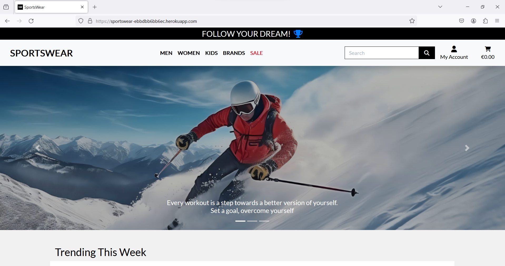
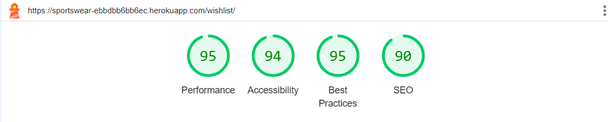

# Testing

Return back to the [README.md](README.md) file.

During the development of this project, I conducted numerous tests to ensure the proper functioning of the website. In this section, you will find documentation on all tests performed on the site.

## Code Validation

I tested all my code using each language's preferred programming tools.

### HTML

I have used the recommended [HTML W3C Validator](https://validator.w3.org) to validate all of my HTML files.

| Page | W3C URL | Screenshot | Notes |
| --- | --- | --- | --- |
| Home | [W3C](https://validator.w3.org/nu/?doc=https%3A%2F%2Fsportswear-ebbdbb6bb6ec.herokuapp.com%2F) |  | Pass: No Errors |
| All Products | [W3C](https://validator.w3.org/nu/?doc=https%3A%2F%2Fsportswear-ebbdbb6bb6ec.herokuapp.com%2Fproducts%2F) |  | Pass: No Errors |
| Product Detail | [W3C](https://validator.w3.org/nu/?doc=https%3A%2F%2Fsportswear-ebbdbb6bb6ec.herokuapp.com%2Fproducts%2F13%2F) | ![screenshot] | Pass: No Errors |
| Contact | [W3C](https://validator.w3.org/nu/?doc=https%3A%2F%2Fsportswear-ebbdbb6bb6ec.herokuapp.com%2Fcontact) |  | Pass: No Errors |
| Privacy Policy | [W3C](https://validator.w3.org/nu/?doc=https%3A%2F%2Fsportswear-ebbdbb6bb6ec.herokuapp.com%2Fprivacy_policy) |  | Pass: No Errors |
| Returns | [W3C](https://https://validator.w3.org/nu/?doc=https%3A%2F%2Fsportswear-ebbdbb6bb6ec.herokuapp.com%2Freturns) |  | Pass: No Errors |
| Sign Up | [W3C](https://validator.w3.org/nu/?doc=https%3A%2F%2Fsportswear-ebbdbb6bb6ec.herokuapp.com%2Faccounts%2Fsignup%2F) |  | Pass: No Errors |
| Sign In | [W3C](https://validator.w3.org/nu/?doc=https%3A%2F%2Fsportswear-ebbdbb6bb6ec.herokuapp.com%2Faccounts%2Flogin%2F) |  | Pass: No Errors |
| Search | [W3C](https://validator.w3.org/nu/?doc=https%3A%2F%2Fsportswear-ebbdbb6bb6ec.herokuapp.com%2Fproducts%2F%3Fq%3Djacket) |  | Pass: No Errors |
| Log Out | [W3C](https://validator.w3.org/nu/?doc=https%3A%2F%2Fsportswear-ebbdbb6bb6ec.herokuapp.com%2Faccounts%2Flogout%2F) |  | Pass: No Errors |
| Basket | [W3C](https://validator.w3.org/nu/?doc=https%3A%2F%2Fsportswear-ebbdbb6bb6ec.herokuapp.com%2Fbag%2F) |  | Pass: No Errors |
| Checkout | [W3C](https://validator.w3.org/nu/?doc=https%3A%2F%2Fsportswear-ebbdbb6bb6ec.herokuapp.com%2Fcheckout%2F) |  | Pass: No Errors|
| Checkout Success | [W3C](https://validator.w3.org/nu/?doc=https%3A%2F%2Fsportswear-ebbdbb6bb6ec.herokuapp.com%2Fcheckout%2Fcheckout_success%2FBC80EDE13F7D41A4A98524CDF77A6514) |  | Pass: No Errors |
| Profile | n/a | | Pass: No Errors |
| Add Product | [W3C](https://validator.w3.org/nu/?doc=https%3A%2F%2Fsportswear-ebbdbb6bb6ec.herokuapp.com%2Fproducts%2Fadd) |  | Pass: No Errors |
| Edit Product | [W3C](https://validator.w3.org/nu/?doc=https%3A%2F%2Fsportswear-ebbdbb6bb6ec.herokuapp.com%2Fproducts%2Fedit%2F3%2F) |  | Pass: No Errors |
| Update Review | [W3C](https://validator.w3.org/nu/?doc=https%3A%2F%2Fsportswear-ebbdbb6bb6ec.herokuapp.com%2Fproducts%2Fupdate_review%2F15%2F) |  | Pass: No Errors |
| Delete Review | [W3C](https://validator.w3.org/nu/?doc=https%3A%2F%2Fsportswear-ebbdbb6bb6ec.herokuapp.com%2Fproducts%2Fdelete_review%2F15%2F) |  | Pass: No Errors |
| Wishlist | [W3C](https://validator.w3.org/nu/?doc=https%3A%2F%2Fsportswear-ebbdbb6bb6ec.herokuapp.com%2Fwishlist%2F) |  | Pass: No Errors |

### CSS

I have used the recommended [CSS Jigsaw Validator](https://jigsaw.w3.org/css-validator) to validate all of my CSS files.

| File | Jigsaw URL | Screenshot | Notes |
| --- | --- | --- | --- |
| base.css | n/a  |  | Pass: No Errors |
| checkout.css | n/a |  | Pass: No Errors |
| profile.css | n/a |  | Pass: No Errors |

### JavaScript

I have used the recommended [JShint Validator](https://jshint.com) to validate all of my JS files.

| File | Screenshot | Notes |
| --- | --- | --- |
| base.html (postloadjs) | | Pass: No Errors |
| countryfields.js |  | Pass: No Errors |
| add_product.html (postloadjs) |  | Pass: No Errors |
| edit_product.html (postloadjs) |  | Pass: No Errors |
| products.html (postloadjs) |  | Pass: No Errors |
| bag.html (postloadjs) |  | Pass: No Errors |
| quantity_input_script.html (script) |  | Undefined "minusDisabled" and "plusDisabled" variables |
| stripe_elements.js |  | Undefined Stripe variable |

### Python

I have used the recommended [CI Python Linter](https://pep8ci.herokuapp.com) to validate all of my Python files.

| File | CI URL | Screenshot | Notes |
| --- | --- | --- | --- |
| Bag contexts.py | n/a |  | Pass: No Errors |
| Bag urls.py | n/a |  | Pass: No Errors |
| Bag views.py | n/a |  | Pass: No Errors |
| Base urls.py | n/a  |  | Pass: No Errors |
| Base views.py | n/a  |  | Pass: No Errors |
| Checkout admin.py | n/a  |  | Pass: No Errors |
| Checkout forms.py | n/a |  | Pass: No Errors |
| Checkout models.py | n/a  |  | Pass: No Errors |
| Checkout signals.py | n/a |  | Pass: No Errors |
| Checkout urls.py | n/a |  | Pass: No Errors |
| Checkout views.py | n/a  |  | Pass: No Errors |
| Checkout webhook_handler.py | n/a |  | Pass: No Errors |
| Checkout webhooks.py | n/a | | Pass: No Errors |
| Home urls.py | n/a |  | Pass: No Errors |
| Home views.py | n/a | ! | Pass: No Errors |
| Home forms.py | n/a |  | Pass: No Errors |
| Home models.py | n/a |  | Pass: No Errors |
| Home admin.py | n/a |  | Pass: No Errors |
| Products admin.py |  n/a |  | Pass: No Errors |
| Products forms.py | n/a |  | Pass: No Errors |
| Products models.py |  n/a |  | Pass: No Errors |
| Products urls.py | n/a  |  | Pass: No Errors |
| Products views.py | n/a  |  | Pass: No Errors |
| Products widgets.py | n/a | | Pass: No Errors |
| Profiles forms.py | n/a  |  | Pass: No Errors |
| Profiles models.py | n/a|  | Pass: No Errors |
| Profiles urls.py | n/a |  | Pass: No Errors |
| Profiles views.py | n/a |  | Pass: No Errors |
| Wishlist admin.py | n/a  |  | Pass: No Errors |
| Wishlist models.py | n/a|  | Pass: No Errors |
| Wishlist urls.py | n/a |  | Pass: No Errors |
| Wishlist views.py | n/a |  | Pass: No Errors |
| Base settings.py | n/a  | ![screenshot]| Pass: No Errors |
| Base urls.py | n/a |  | Pass: No Errors |
| Base views.py | n/a |  | Pass: No Errors |

## Browser Compatibility

I've tested my deployed project on multiple browsers to check for compatibility issues.

| Browser | Screenshot | Notes |
| --- | --- | --- |
| Chrome |  | Works as expected |
| Firefox |  | Works as expected |
| Edge |  | Works as expected |

## Responsiveness

I've tested my deployed project on multiple devices to check for responsiveness issues.

| Device | Screenshot | Notes |
| --- | --- | --- |
| Mobile (DevTools) |    | Works as expected |
| Tablet (DevTools) |    | Works as expected |
| Laptop |   | Works as expected |
| Desktop |   | Works as expected |

## Lighthouse Audit

I've tested my deployed project using the Lighthouse Audit tool to check for any major issues.

| Page | Size | Screenshot | Notes |
| --- | --- | --- | --- |
| Home | Desktop |  | No major warnings |
| Home | Mobile |  | Some minor warnings |
| Products | Desktop | | Some minor warnings |
| Products | Mobile |  | Some minor warnings |
| Product detail | Desktop |  | Some minor warnings |
| Product detail | Mobile |  | Some minor warnings |
| Contact | Desktop |  | No major warnings |
| Contact | Mobile |  | Some minor warnings |
| Wishlist | Desktop |  | No major warnings |
| Wishlist  | Mobile |  | Some minor warnings |
| Sign Up | Desktop |  | Some minor warnings |
| Sign Up | Mobile |  | Some minor warnings |
| Sign In | Desktop |  | Some minor warnings |
| Sign In | Mobile |  | Some minor warnings |
| Search | Desktop |  | Some minor warnings |
| Search | Mobile |  | Some minor warnings |
| Log Out | Desktop |  | No major warnings |
| Log Out | Mobile |  | Some minor warnings |
| Basket | Desktop |  | Some minor warnings |
| Basket | Mobile |  | Some minor warnings |
| Checkout | Desktop |  | Some minor warnings |
| Checkout | Mobile |  | Some minor warnings |
| Profile | Desktop |  | Some minor warnings |
| Profile | Mobile |  | Some minor warnings |

## Manual testing

Below are the results of manual testing:

| Page | User Action | Expected Result | Pass/Fail | Comments |
| --- | --- | --- | --- | --- |
| **Home Page** | | | | |
| | Click on Logo | Redirection to Home page | Pass | |
| | Click on to the product card in "Trending This Week" | Redirection to Product Detail page | Pass | |
| **Search** | | | | |
| | Enter word into search bar that appears in at least one product's name or description | Redirection to Products page | Pass | Products filtered to only show products containing search term |
| | Enter word into search bar that doesn't appear in any product's name or description | Redirection to Products page | Pass | Products page is empty and shows user that 0 products were returned |
| | Enter nothing into search bar | Redirection to Products page | Pass | Error message shows and lets user know they entered nothing into the search bar and all products are displayed |
| **Products Page** | | | | |
| | Click on  Men by Hoodies & Sweatshirts link in navbar | Redirect to Hoodies and Sweatshirts page for men | Pass | |
| | Click on  Men by Jackets link in navbar | Redirection to Jackets page for men  | Pass | |
| | Click on  Men by All Clothing link in navbar | Redirection to Clothing page  for men | Pass |  |
| | Click on  Men by Socks link in navbar | Redirection to Socks page for men| Pass |  |
| | Click on  Men by Bags link in navbar | Redirection to Bags page for men| Pass |  |
| | Click on  Men by All Accessoires link in navbar | Redirection to All Accessoires page for men |  |
| | Click on  Women by Hoodies & Sweatshirts link in navbar | Redirect to Hoodies and Sweatshirts page for women | Pass | |
| | Click on  Women by Jackets link in navbar | Redirection to Jackets page for women  | Pass | |
| | Click on  Women by All Clothing link in navbar | Redirection to Clothing page  for women | Pass |  |
| | Click on  Women by Socks link in navbar | Redirection to Socks page for women| Pass |  |
| | Click on  Women by Bags link in navbar | Redirection to Bags page for women| Pass |  |
| | Click on  Women by All Accessoires link in navbar | Redirection to All Accessoires page for women |  |
| | Click on  Kids by Hoodies & Sweatshirts link in navbar | Redirect to Hoodies and Sweatshirts page for kids | Pass | |
| | Click on  Kids by Jackets link in navbar | Redirection to Jackets page for kids  | Pass | |
| | Click on  Kids by All Clothing link in navbar | Redirection to Clothing page  for kids | Pass |  |
| | Click on  Kids by Hats link in navbar | Redirection to Hats page for kids| Pass |  |
| | Click on  Kids by Bags link in navbar | Redirection to Bags page for kids| Pass |  |
| | Click on  Kids by All Accessoires link in navbar | Redirection to All Accessoires page for kids |  |
| | Click on  Brands by Adidas link in navbar | Redirect to  Adidas page | Pass | |
| | Click on  Brands by Nike link in navbar | Redirection to Nike page  | Pass | |
| | Click on  Brands by Puma link in navbar | Redirection to Puma page | Pass |  |
| | Click on  Brands by All Brands link in navbar | Redirection to All Brands page  | Pass |  |
| | Click on  Sale link in navbar | Redirection to Sale page  | Pass |  |
| **Product Detail Page** | | | | |
| | Click on Product image or name in Products page | Redirection to Product Detail page | Pass | |
| | Click on Keep Shopping button | Redirection to  Products page | Pass | |
| | Click + button on quantity selector form | The quantity increases if the number + 1 to 99 | Pass | |
| | Click - button on quantity selector form | Quantity number decreases if current quantity is greater than one | Pass | |
| | Manually enter number greater than 99 in quantity selector form | The quantity is automatically changed to the maximum allowed quantity of 99 | Pass | |
| | Manually enter a negative number | An error message appears that the number must be greater than or equal to 1 | Pass | |
| | Click Add To Basket button | Product is added to basket and quantity is set to the user's choice | Pass | |
| | Click Add To Basket button when user already has the product in their basket | Quantity selected is added to the existing quantity in the user's basket for the product | Pass |  |
| | Click on edit product button | Redirection to Edit Product page for that product | Pass | Button only appears if logged in user is an admin |
| | Click on delete product button | Redirection to Delete Product confirmation page for that product | Pass | Button only appears if logged in user is an admin |
|**Reviews Page** | | | | |
| | Click on "Review This Product" button | Additional fields “Title” and “Review” will open below for writing a review | Pass | |
| | Click on Submit Review button with missing fields | The user will see a message indicating that the review was not sent | Pass | |
| | Click on Submit Review button with all valid fields | The user will see a message indicating that a review has been added | Pass | |
| | Click on Update Review button | Redirection to Edit Review page| Pass |  |
| | Click on Update button | Redirect to product detail page with already edited review | Pass |  |
| | Click on Delete Review button | Redirect to Delete Review page | Pass |  |
| | Click on Delete Review button on Delete Review page | Review will be deleted and the user will be redirected to detail page | Pass |  |
| **WishList Page** | | | | |
| | Click on the heart icon on Products page or on the Product Detail page | Redirection to Blog Post page | Pass | |
| | Click on the heart icon in the nav bar | Redirect to Wishlist page | Pass | |
| | Сlick on the binoculars icon | Redirect to product page | Pass | |
| | Click on the trash can icon| The item will be removed from the Wishlist page and the user will see a success message | Pass | |
| | Click on CLEAR WISHLIST link | All products are removed from the Wishlist| Pass | |
| | Click on Go To Product button |  Redirection to Products page | Pass | This button is visible when all products from their Wishlist are deleted|
| **Sign Up Page** | | | | |
| | Click on Register button under account on nav menu | Redirection to Sign Up page | Pass | |
| | Enter valid email address | Field will only accept email address format | Pass | |
| | Enter valid password (twice) | Field will only accept password format | Pass | |
| | Click Sign Up button on sign up page | Sends confirmation email and lets user know to check their email | Pass | |
| | Click link in confirmation email | Redirects user to sign in page | Pass | |
| **Sign In Page** | | | | |
| | Click on the Login button under account on nav menu | Redirection to Login page | Pass | |
| | Enter valid email address | Field will only accept email address format | Pass | |
| | Enter valid password | Field will only accept password format | Pass | |
| | Click Login button on login page | Redirects user to homepage | Pass | |
| | Sign in before confirming account | Redirects to message reminding user to confirm email address | Pass | |
| **Log Out Page** | | | | |
| | Click Logout button | Redirects user to logout page | Pass | Confirms logout first |
| | Click Confirm Logout button | Redirects user to home page | Pass | |
| **User Profile Page** | | | | |
| | Click on the My Profile link under account on nav menu | Redirection to User profile page page | Pass | Only shows for logged in users |
| | Click Update Information button | Saves form contents to be default information for user | Pass | Default information is cleared if form is submitted while blank |
| | Click Order Number for previous order in Order History | Redirects user to order confirmation page for that order | Pass | |
| | Brute forcing the URL to profile if not logged in | User given an error | Pass | Redirects user to error page |
| **Basket** | | | | |
| | Click Basket icon in main nav | Redirects user to basket page | Pass | Shows back to shop button if basket is empty |
| | Click + button on quantity selector form | The quantity increases if the number + 1 to 99 | Pass | |
| | Click - button on quantity selector form | Quantity number decreases if current quantity is greater than one | Pass | |
| | Manually enter number greater than 99 in quantity selector form | The quantity is automatically changed to the maximum allowed quantity of 99 | Pass | |
| | Manually enter a negative number | This item is automatically removed from the cart after clicking the Update icon because the value entered is incorrect | Pass | |
| | Click icon update  under quantity selector form | Updated quantity of product in basket to number in quantity select form | Pass | |
| | Click icon remove button under quantity selector form | Removes product from basket completely | Pass | |
| | Remove item from basket that brings total to below €50 | Delivery goes from FREE to 10% of the total cost of the basket contents | Pass | |
| | Click on Keep Shopping button | Redirection to Products page | Pass | |
| | Click on Secure Checkout button | Redirection to checkout page | Pass | |
| **Checkout** | | | | |
| | Click on Secure Checkout button in basket | Redirection to checkout page | Pass | |
| | Click Complete Order button without all required fields filled out | Message letting user know that required fields need to be filled out | Pass | |
| | Click Save delivery information to profile button | User's default information will be set to whatever is filled in at the checkout on order completion | Pass | Only visible to logged in users |
| | Click on Create an account link | Redirection to sign up page | Pass | Only visible to logged out users |
| | Click on login link | Redirection to sign in page | Pass | Only visible to logged out users |
| | Click Complete Order button without card details filled out | Message letting user know that their card number is incomplete | Pass | |
| | Click Complete Order button with all details filled out | Loading spinner appears and order is processed | Pass | |
| | Order completed | Order confirmation email is sent to the user and redirection to checkout success page | Pass | |
| **Checkout Success Page** | | | | |
| | Order completed | Redirection to checkout success page | Pass | |
| | Click Checkout latest deals button | Redirects user to Products page | Pass | Only visible if user comes to this page straight from order completion |
| | Click Back to profile button button | Redirects user to their profile | Pass | Only visible if user comes to this page from the order history list on their profile |
| **Add Product Page** | | | | |
| | Click Product Management link from My Account dropdown | Redirects admin to add product page | Pass | User can only see this if they're logged in as an admin |
| | Click Cancel button | Redirects admin to Products page | Pass | |
| | Click Add Product button with form filled correctly | Creates a new product on the site using the information provided | Pass | |
| | Click Add Product button with form filled incorrectly | Message appears letting the admin know to fill in the required form fields | Pass | |
| | Click Add Product button with no image set | Product will be created but will be displayed with default product image | Pass | |
| **Edit Product Page** | | | | |
| | Click edit icon on product | Redirects user to Edit Product page | Pass | User must be an admin to see icon and access this page |
| | Click Cancel button | Redirects admin to all products page | Pass | |
| | Click Update Product button with form filled correctly | Updates product with information provided | Pass | |
| | Click Update Product button with form filled incorrectly | Message appears letting the admin know to fill in the required form fields | Pass | |
| | Click Update Product button with no image set | Product will be updated but will be displayed with default product image | Pass | |
| **Delete Product Page** | | | | |
| | Click delete icon on product | Redirects user to Edit Product page | Pass | User must be an admin to see icon and access this page |
| | Click Cancel button | Redirects admin to product detail page for selected product | Pass | |
| | Click Delete Product button | Product will be completely deleted from the site | Pass | |
| **Footer** | | | | |
| | Click Home link in footer | Redirects user to Home page | Pass | |
| | Click Contact Us link in footer | Redirects user to Сontact Us page | Pass | |
| | Click Privacy Policy link in footer | Redirects user to Privacy Policy page | Pass | |
| | Click Privacy Returns in footer | Redirects user to Returns page | Pass | |
| | Click social media icons in footer | Opens social media site clicked in a new tab | Pass | |
| | Click on Subscribe button on blank newsletter form | An error message appears prompting the user to complete the field| Pass | |
| | Click on Subscribe button on filled newsletter form | Alert message lets user know they have signed up for the mailing list | Pass | |
| | Try to subscribe to newsletter with already subscribed email address | A message appears to the user indicating that he has already subscribed to the newsletter. | Pass | |
| **Contact Page** | | | | |
| | Click on Contact Us link in footer | The heart icon will fill with color and the user will see a message that the product has been added to the wishlist | Pass | |
| | Enter name | Form will only submit if all fields are filled | Pass | |
| | Enter valid email address | Field will only accept email address format | Pass | |
| | Enter message | Form will only submit if all fields are filled | Pass | |
| | Click Send with missing fields | Message lets user know all fields are required | Pass | |
| | Click Send with all valid fields | The user will see a success message in the upper right corner and administrators in the admin panel will see this message | Pass | |

## User Story Testing

Below are the user stories I've included, along with corresponding screenshots for you to check out

| User Story | Screenshot |
| --- | --- |
| As a user I can view products so that I can decide which items I want to purchase |  |
| In my user role, I am equipped with the capability to search through all products and explore various categories. This functionality guarantees that I only encounter products of personal interest |   |
| As a site user, I want the site to be responsive. | Mobile: Tablet: Desktop:|
| As a site user, I would appreciate the ability to filter products based on gender. This feature enables me to tailor my product search according to specific gender categories, streamlining the shopping experience and helping me find relevant items more efficiently. |  |
|As a site user, I would like to have the capability to browse products based on categories. This functionality allows me to easily navigate through distinct product categories, enhancing my ability to find items aligned with my preferences. |   |
| As a user, I possess the ability to review the items present in my shopping basket. This feature facilitates the identification of the total cost of my purchase and all the items included. | .
| In my user role, I can effortlessly assess the total cost of my purchases. This feature aids me in avoiding unnecessary expenditure. |  | |
| In my user role, I should experience a sense of confidence in the security and safety of my payment information. This sense of assurance allows me to confidently provide the necessary details for making a purchase.|  |
| As a site user, I have the ability to initiate the creation of an account. This functionality serves the purpose of allowing me to store my information for convenient repeat purchases and to review my order history. |  |
| As a user, I would like the ability to make purchases without creating an account, ensuring a quick and convenient payment process. | |
| As a user of the site, I want to be able to update and save delivery information to my profile if necessary. |  |
| In my user role, I want to add products to a Wishlist. This functionality simplifies the process of tracking items I plan to purchase in the future |   |
| As a user role, I want to subscribe to the newsletter. This subscription ensures that I stay up to date with new products and promotions. |   |
| As a site administrator, I want to be able to access and use the admin panel. This feature allows me to efficiently perform tasks such as creating, updating, managing and deleting products and orders. |  |
| As a site user, I would like to receive order confirmation emails containing detailed information about my purchase, including the ordered items and the total amount. This feature ensures that I stay informed about the specifics of my order and provides a convenient record of the transaction sent directly to my email. |  |
| As a site user, I would like the ability to read product reviews and also to leave my own feedback. This feature provides me with valuable insights from other users' experiences, helping me make informed decisions about a product. Additionally, it allows me to contribute to the community by sharing my thoughts and opinions on the items I've purchased. |  |

Below are the user stories that I plan to implement in the future:

| User Story | Screenshot |
| --- | --- |
| As a user, I should be able to easily recover my password, ensuring continued access to my account in the event that my password is forgotten.| N/A |

## Automated Testing

Automatic testing results are below.

### Python (Unit Testing)

I have used Django's built-in unit testing framework to test the application functionality.

In order to run the tests, I ran the following command in the terminal each time:

`python3 manage.py test `

`python-m coverage report `

**Open Issues**

| Bug | Status |
| --- | --- |
| [USER STORY: Password Recovery ](https://github.com/CodeWizard-1/e-commerce/issues/17) | Open |